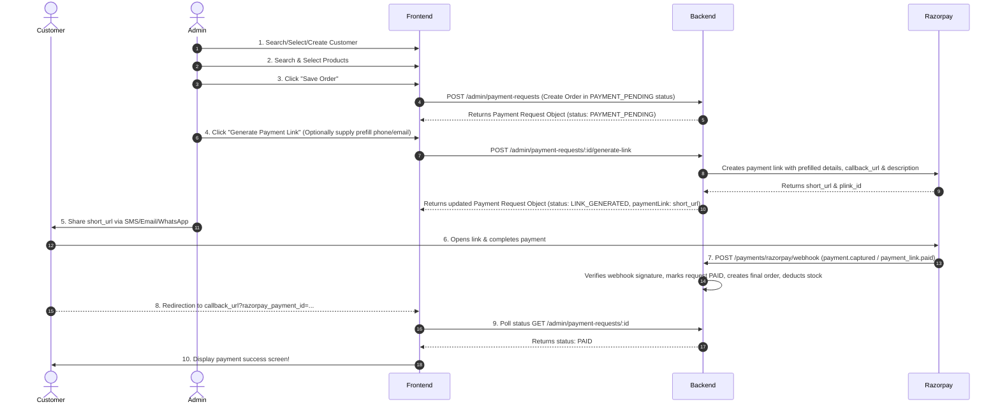

# Razorpay Payment Flow - API Documentation & Integration Guide

This document details the architectural flow, database schema mappings, API specifications, and testing guidelines for the **Admin Order Management & Razorpay Payment Flow**.

---

## 1. Frontend Integration Flow

Here is the step-by-step integration workflow for the frontend developer:



---

## 2. Base URLs

```
Development
http://localhost:3000/api/v1

Staging
https://staging-api.cureka.com/api/v1

Production
https://api.cureka.com/api/v1
```

---

## 3. Authentication

All endpoints under the `/admin` path require authentication.
* **Header:** `Authorization: Bearer <TOKEN>` (or via `admin_token` cookie)
* **Access Level:** Required roles/permissions are documented per endpoint.

---

## 4. Payment & Order APIs

### 4.1. Search Customers
* **Endpoint:** `GET /admin/customers/search`
* **Method:** `GET`
* **Authentication:** Required (Roles: `super_admin`, `admin`, `telecaller`)
* **Headers:**
  ```http
  Authorization: Bearer <TOKEN>
  ```
* **Query Parameters:**
  * `search` (string, optional) - Filters by first name, last name, email, or mobile number.
  * `page` (number, optional, default: 1)
  * `limit` (number, optional, default: 20)
* **Success Response (200 OK):**
  ```json
  {
    "success": true,
    "message": "Customers retrieved successfully",
    "data": {
      "items": [
        {
          "id": "2701a5b8-501b-402c-aef6-92d507ad62d2",
          "refId": "USR00000001",
          "firstName": "John",
          "lastName": "Doe",
          "name": "John Doe",
          "email": "john.doe@example.com",
          "phone": "9876543210",
          "mobileNumber": "9876543210",
          "isGuest": false,
          "isRegistered": true,
          "status": "active",
          "role": "customer"
        }
      ],
      "meta": {
        "totalItems": 1,
        "itemCount": 1,
        "itemsPerPage": 20,
        "totalPages": 1,
        "currentPage": 1
      }
    },
    "timestamp": "2026-07-01T10:45:00.000Z"
  }
  ```
* **Validation Rules:**
  * `search`: String, max 100 characters.
  * `page`: Number, minimum 1.
  * `limit`: Number, minimum 1.
* **cURL Example:**
  ```bash
  curl -X GET "http://localhost:3000/api/v1/admin/customers/search?search=John" \
    -H "Authorization: Bearer <TOKEN>"
  ```
* **JavaScript Fetch Example:**
  ```javascript
  fetch("http://localhost:3000/api/v1/admin/customers/search?search=John", {
    method: "GET",
    headers: { "Authorization": "Bearer " + token }
  })
  .then(res => res.json())
  .then(data => console.log(data));
  ```
* **Axios Example:**
  ```javascript
  axios.get("http://localhost:3000/api/v1/admin/customers/search", {
    params: { search: "John" },
    headers: { Authorization: `Bearer ${token}` }
  })
  .then(res => console.log(res.data));
  ```

---

### 4.2. Create Customer
* **Endpoint:** `POST /admin/customers`
* **Method:** `POST`
* **Authentication:** Required (Roles: `super_admin`, `admin`, `telecaller`)
* **Headers:**
  ```http
  Authorization: Bearer <TOKEN>
  Content-Type: application/json
  ```
* **Request Body:**
  ```json
  {
    "firstName": "Jane",
    "lastName": "Smith",
    "mobileNumber": "+919999888777",
    "email": "jane.smith@example.com"
  }
  ```
* **Success Response (201 Created):**
  ```json
  {
    "success": true,
    "message": "Customer created successfully",
    "data": {
      "id": "e45a0b7b-23f0-4566-a36b-95bb8e46927d",
      "refId": "USR00000045",
      "firstName": "Jane",
      "lastName": "Smith",
      "email": "jane.smith@example.com",
      "mobileNumber": "+919999888777",
      "isGuest": false,
      "isRegistered": true,
      "status": "active",
      "role": "customer"
    },
    "timestamp": "2026-07-01T10:45:00.000Z"
  }
  ```
* **Error Response (409 Conflict):**
  ```json
  {
    "success": false,
    "message": "A customer with this mobile number already exists",
    "error": "Conflict",
    "statusCode": 409
  }
  ```
* **Validation Rules:**
  * `firstName`: String, required, max 100 characters.
  * `lastName`: String, required, max 100 characters.
  * `mobileNumber`: String, required, must match valid Indian mobile number format.
  * `email`: String, optional, valid email format, max 255 characters.
* **cURL Example:**
  ```bash
  curl -X POST http://localhost:3000/api/v1/admin/customers \
    -H "Authorization: Bearer <TOKEN>" \
    -H "Content-Type: application/json" \
    -d '{"firstName":"Jane","lastName":"Smith","mobileNumber":"+919999888777","email":"jane.smith@example.com"}'
  ```
* **JavaScript Fetch Example:**
  ```javascript
  fetch("http://localhost:3000/api/v1/admin/customers", {
    method: "POST",
    headers: {
      "Authorization": "Bearer " + token,
      "Content-Type": "application/json"
    },
    body: JSON.stringify({
      firstName: "Jane",
      lastName: "Smith",
      mobileNumber: "+919999888777",
      email: "jane.smith@example.com"
    })
  })
  .then(res => res.json())
  .then(data => console.log(data));
  ```
* **Axios Example:**
  ```javascript
  axios.post("http://localhost:3000/api/v1/admin/customers", {
    firstName: "Jane",
    lastName: "Smith",
    mobileNumber: "+919999888777",
    email: "jane.smith@example.com"
  }, {
    headers: { Authorization: `Bearer ${token}` }
  })
  .then(res => console.log(res.data));
  ```

---

### 4.3. Search Products
* **Endpoint:** `GET /admin/payment-requests/product-search`
* **Method:** `GET`
* **Authentication:** Required (Permission: `payment-request.read`)
* **Headers:**
  ```http
  Authorization: Bearer <TOKEN>
  ```
* **Query Parameters:**
  * `search` (string, required) - Matches against product name or variant SKU.
  * `limit` (number, optional, default: 20)
* **Success Response (200 OK):**
  ```json
  {
    "success": true,
    "message": "Products retrieved successfully",
    "data": [
      {
        "productId": "44901f4c-1d70-4f51-83b6-79177a2ad3bb",
        "productName": "Cureka Hydrating Face Wash",
        "variants": [
          {
            "variantId": "cf3692e0-2aa3-4f9e-a89e-28c049e29a3a",
            "sku": "CUR-FW-100ML",
            "mrp": "450.00",
            "sellingPrice": "399.00",
            "stock": 150,
            "attributeLabel": "100ml / Sensitive Skin"
          }
        ]
      }
    ],
    "timestamp": "2026-07-01T10:45:00.000Z"
  }
  ```
* **Validation Rules:**
  * `search`: String, required.
* **cURL Example:**
  ```bash
  curl -X GET "http://localhost:3000/api/v1/admin/payment-requests/product-search?search=Hydrating" \
    -H "Authorization: Bearer <TOKEN>"
  ```
* **JavaScript Fetch Example:**
  ```javascript
  fetch("http://localhost:3000/api/v1/admin/payment-requests/product-search?search=Hydrating", {
    method: "GET",
    headers: { "Authorization": "Bearer " + token }
  })
  .then(res => res.json())
  .then(data => console.log(data));
  ```
* **Axios Example:**
  ```javascript
  axios.get("http://localhost:3000/api/v1/admin/payment-requests/product-search", {
    params: { search: "Hydrating" },
    headers: { Authorization: `Bearer ${token}` }
  })
  .then(res => console.log(res.data));
  ```

---

### 4.4. Create Order (Save in Pending Status)
* **Endpoint:** `POST /admin/payment-requests`
* **Method:** `POST`
* **Authentication:** Required (Permission: `payment-request.create`)
* **Headers:**
  ```http
  Authorization: Bearer <TOKEN>
  Content-Type: application/json
  ```
* **Request Body:**
  ```json
  {
    "customerId": "e45a0b7b-23f0-4566-a36b-95bb8e46927d",
    "customerPhone": "+919999888777",
    "customerEmail": "jane.smith@example.com",
    "items": [
      {
        "productId": "44901f4c-1d70-4f51-83b6-79177a2ad3bb",
        "variantId": "cf3692e0-2aa3-4f9e-a89e-28c049e29a3a",
        "quantity": 2,
        "unitPrice": "399.00",
        "discount": "0.00",
        "tax": "18.00"
      }
    ],
    "discount": "50.00",
    "tax": "36.00",
    "shipping": "40.00",
    "handling": "10.00",
    "finalAmount": "834.00",
    "notes": "Add premium packaging"
  }
  ```
* **Success Response (201 Created):**
  ```json
  {
    "success": true,
    "message": "Payment request created successfully",
    "data": {
      "id": "b182cbdf-c93d-4c3e-8ff5-ee9f8352b2f6",
      "refId": "PAY20261234",
      "customerId": "e45a0b7b-23f0-4566-a36b-95bb8e46927d",
      "status": "PAYMENT_PENDING",
      "subtotal": "834.00",
      "discount": "50.00",
      "tax": "36.00",
      "shipping": "40.00",
      "handling": "10.00",
      "totalAmount": "834.00",
      "currency": "INR",
      "notes": "Add premium packaging",
      "paymentProvider": "RAZORPAY",
      "paymentLink": null,
      "providerReferenceId": null,
      "createdAt": "2026-07-01T10:45:00.000Z"
    },
    "timestamp": "2026-07-01T10:45:00.000Z"
  }
  ```
* **Validation Rules:**
  * `customerId`: UUID, optional. If omitted, `customerPhone` must be present and valid.
  * `items`: Array, required, cannot be empty.
    * `productId`: UUID, required.
    * `variantId`: UUID, required.
    * `quantity`: Integer, required, minimum 1.
    * `unitPrice`: Decimal string, required, must be greater than zero.
* **cURL Example:**
  ```bash
  curl -X POST http://localhost:3000/api/v1/admin/payment-requests \
    -H "Authorization: Bearer <TOKEN>" \
    -H "Content-Type: application/json" \
    -d '{
      "customerId": "e45a0b7b-23f0-4566-a36b-95bb8e46927d",
      "customerPhone": "+919999888777",
      "items": [
        {
          "productId": "44901f4c-1d70-4f51-83b6-79177a2ad3bb",
          "variantId": "cf3692e0-2aa3-4f9e-a89e-28c049e29a3a",
          "quantity": 2,
          "unitPrice": "399.00"
        }
      ]
    }'
  ```
* **JavaScript Fetch Example:**
  ```javascript
  fetch("http://localhost:3000/api/v1/admin/payment-requests", {
    method: "POST",
    headers: {
      "Authorization": "Bearer " + token,
      "Content-Type": "application/json"
    },
    body: JSON.stringify({
      customerId: "e45a0b7b-23f0-4566-a36b-95bb8e46927d",
      customerPhone: "+919999888777",
      items: [
        {
          productId: "44901f4c-1d70-4f51-83b6-79177a2ad3bb",
          variantId: "cf3692e0-2aa3-4f9e-a89e-28c049e29a3a",
          quantity: 2,
          unitPrice: "399.00"
        }
      ]
    })
  })
  .then(res => res.json())
  .then(data => console.log(data));
  ```
* **Axios Example:**
  ```javascript
  axios.post("http://localhost:3000/api/v1/admin/payment-requests", {
    customerId: "e45a0b7b-23f0-4566-a36b-95bb8e46927d",
    customerPhone: "+919999888777",
    items: [
      {
        productId: "44901f4c-1d70-4f51-83b6-79177a2ad3bb",
        variantId: "cf3692e0-2aa3-4f9e-a89e-28c049e29a3a",
        quantity: 2,
        unitPrice: "399.00"
      }
    ]
  }, {
    headers: { Authorization: `Bearer ${token}` }
  })
  .then(res => console.log(res.data));
  ```

---

### 4.5. Generate Payment Link (Support prefilled details & redirect callback URLs)
* **Endpoint:** `POST /admin/payment-requests/:id/generate-link`
* **Method:** `POST`
* **Authentication:** Required (Permission: `payment-request.generate-link`)
* **Headers:**
  ```http
  Authorization: Bearer <TOKEN>
  Content-Type: application/json
  ```
* **Request Body:**
  *(Optional - if omitted, default values from database customer record will be prefilled automatically)*
  ```json
  {
    "phone": "9876543210",
    "email": "jane.smith@example.com"
  }
  ```
* **Success Response (200 OK):**
  ```json
  {
    "success": true,
    "message": "Payment link generated successfully",
    "data": {
      "id": "b182cbdf-c93d-4c3e-8ff5-ee9f8352b2f6",
      "refId": "PAY20261234",
      "status": "LINK_GENERATED",
      "totalAmount": "834.00",
      "paymentLink": "https://rzp.io/i/abcdefg",
      "providerReferenceId": "plink_Gz72H1iO9as2d1",
      "expiresAt": "2026-07-04T10:45:00.000Z"
    },
    "timestamp": "2026-07-01T10:46:00.000Z"
  }
  ```
* **Validation Rules:**
  * `phone`: String, mandatory only if request body is not empty.
  * `email`: String, optional, valid email format.
* **cURL Example:**
  ```bash
  curl -X POST http://localhost:3000/api/v1/admin/payment-requests/b182cbdf-c93d-4c3e-8ff5-ee9f8352b2f6/generate-link \
    -H "Authorization: Bearer <TOKEN>" \
    -H "Content-Type: application/json" \
    -d '{"phone":"9876543210","email":"jane.smith@example.com"}'
  ```
* **JavaScript Fetch Example:**
  ```javascript
  fetch("http://localhost:3000/api/v1/admin/payment-requests/b182cbdf-c93d-4c3e-8ff5-ee9f8352b2f6/generate-link", {
    method: "POST",
    headers: {
      "Authorization": "Bearer " + token,
      "Content-Type": "application/json"
    },
    body: JSON.stringify({
      phone: "9876543210",
      email: "jane.smith@example.com"
    })
  })
  .then(res => res.json())
  .then(data => console.log(data));
  ```
* **Axios Example:**
  ```javascript
  axios.post("http://localhost:3000/api/v1/admin/payment-requests/b182cbdf-c93d-4c3e-8ff5-ee9f8352b2f6/generate-link", {
    phone: "9876543210",
    email: "jane.smith@example.com"
  }, {
    headers: { Authorization: `Bearer ${token}` }
  })
  .then(res => console.log(res.data));
  ```

---

### 4.6. Regenerate Payment Link (Support prefilled details & redirect callback URLs)
* **Endpoint:** `POST /admin/payment-requests/:id/regenerate-link`
* **Method:** `POST`
* **Authentication:** Required (Permission: `payment-request.regenerate`)
* **Headers:**
  ```http
  Authorization: Bearer <TOKEN>
  Content-Type: application/json
  ```
* **Request Body:**
  *(Optional - if omitted, default values from database customer record will be prefilled automatically)*
  ```json
  {
    "phone": "9876543210",
    "email": "jane.smith@example.com"
  }
  ```
* **Success Response (200 OK):**
  ```json
  {
    "success": true,
    "message": "Payment link regenerated successfully",
    "data": {
      "id": "b182cbdf-c93d-4c3e-8ff5-ee9f8352b2f6",
      "refId": "PAY20261234",
      "status": "LINK_GENERATED",
      "totalAmount": "834.00",
      "paymentLink": "https://rzp.io/i/xyz1234",
      "providerReferenceId": "plink_Hw89K3jP0qd4f5",
      "expiresAt": "2026-07-04T10:47:00.000Z"
    },
    "timestamp": "2026-07-01T10:47:00.000Z"
  }
  ```
* **cURL Example:**
  ```bash
  curl -X POST http://localhost:3000/api/v1/admin/payment-requests/b182cbdf-c93d-4c3e-8ff5-ee9f8352b2f6/regenerate-link \
    -H "Authorization: Bearer <TOKEN>" \
    -H "Content-Type: application/json" \
    -d '{"phone":"9876543210"}'
  ```

---

### 4.7. List Orders / Payment Requests (Listing Page)
* **Endpoint:** `GET /admin/payment-requests`
* **Method:** `GET`
* **Authentication:** Required (Permission: `payment-request.read`)
* **Headers:**
  ```http
  Authorization: Bearer <TOKEN>
  ```
* **Query Parameters:**
  * `search` (string, optional) - Matches against Order ID (`refId`), Customer details (Name, Phone, Email), Product Name, or Total Amount.
  * `status` (string, optional) - Filters by status (`PAYMENT_PENDING`, `LINK_GENERATED`, `PAID`, `CANCELLED`, `EXPIRED`).
  * `page` (number, optional, default: 1)
  * `limit` (number, optional, default: 20)
* **Success Response (200 OK):**
  ```json
  {
    "success": true,
    "message": "Payment requests fetched successfully",
    "data": {
      "items": [
        {
          "id": "b182cbdf-c93d-4c3e-8ff5-ee9f8352b2f6",
          "refId": "PAY20261234",
          "customerId": "e45a0b7b-23f0-4566-a36b-95bb8e46927d",
          "status": "LINK_GENERATED",
          "totalAmount": "834.00",
          "paymentLink": "https://rzp.io/i/xyz1234",
          "createdAt": "2026-07-01T10:45:00.000Z",
          "customer": {
            "firstName": "Jane",
            "lastName": "Smith",
            "mobileNumber": "+919999888777",
            "email": "jane.smith@example.com"
          },
          "items": [
            {
              "id": "f512a819-33aa-44bb-ba22-12a3456789bf",
              "productId": "44901f4c-1d70-4f51-83b6-79177a2ad3bb",
              "variantId": "cf3692e0-2aa3-4f9e-a89e-28c049e29a3a",
              "quantity": 2,
              "unitPrice": "399.00",
              "total": "798.00",
              "product": {
                "id": "44901f4c-1d70-4f51-83b6-79177a2ad3bb",
                "name": "Cureka Hydrating Face Wash"
              }
            }
          ]
        }
      ],
      "meta": {
        "totalItems": 1,
        "itemCount": 1,
        "itemsPerPage": 20,
        "totalPages": 1,
        "currentPage": 1
      }
    },
    "timestamp": "2026-07-01T10:48:00.000Z"
  }
  ```
* **cURL Example:**
  ```bash
  curl -X GET "http://localhost:3000/api/v1/admin/payment-requests?status=LINK_GENERATED&search=Jane" \
    -H "Authorization: Bearer <TOKEN>"
  ```

---

### 4.8. Edit Order
* **Endpoint:** `PUT /admin/payment-requests/:id`
* **Method:** `PUT`
* **Authentication:** Required (Permission: `payment-request.update`)
* **Headers:**
  ```http
  Authorization: Bearer <TOKEN>
  Content-Type: application/json
  ```
* **Request Body:**
  ```json
  {
    "items": [
      {
        "productId": "44901f4c-1d70-4f51-83b6-79177a2ad3bb",
        "variantId": "cf3692e0-2aa3-4f9e-a89e-28c049e29a3a",
        "quantity": 3,
        "unitPrice": "399.00",
        "discount": "0.00",
        "tax": "18.00"
      }
    ],
    "discount": "30.00",
    "tax": "54.00",
    "shipping": "40.00",
    "handling": "10.00",
    "finalAmount": "1271.00",
    "notes": "Updated quantity to 3 on request"
  }
  ```
* **Success Response (200 OK):**
  ```json
  {
    "success": true,
    "message": "Payment request updated successfully",
    "data": {
      "id": "b182cbdf-c93d-4c3e-8ff5-ee9f8352b2f6",
      "status": "PAYMENT_PENDING",
      "totalAmount": "1271.00",
      "paymentLink": null,
      "providerReferenceId": null
    },
    "timestamp": "2026-07-01T10:49:00.000Z"
  }
  ```
* **Error Response (400 Bad Request if already paid):**
  ```json
  {
    "success": false,
    "message": "Payment request can only be edited while PAYMENT_PENDING",
    "error": "Bad Request",
    "statusCode": 400
  }
  ```
* **cURL Example:**
  ```bash
  curl -X PUT http://localhost:3000/api/v1/admin/payment-requests/b182cbdf-c93d-4c3e-8ff5-ee9f8352b2f6 \
    -H "Authorization: Bearer <TOKEN>" \
    -H "Content-Type: application/json" \
    -d '{"finalAmount": "1271.00", "items": [{"productId":"44901f4c-1d70-4f51-83b6-79177a2ad3bb","variantId":"cf3692e0-2aa3-4f9e-a89e-28c049e29a3a","quantity":3,"unitPrice":"399.00"}]}'
  ```

---

### 4.9. Webhook Receiver Endpoint
* **Endpoint:** `POST /payments/razorpay/webhook`
* **Method:** `POST`
* **Authentication:** Razorpay Webhook Signature Header (`x-razorpay-signature`)
* **Supported Events:**
  * `payment_link.paid` / `payment.captured` -> Updates order status to PAID & places a completed order in database.
  * `payment.failed` -> Logs event.
  * `payment.pending` -> Logs event.
  * `payment_link.cancelled` -> Updates order status to CANCELLED.
  * `payment_link.expired` -> Updates order status to EXPIRED.
* **Headers:**
  ```http
  x-razorpay-signature: <SIGNATURE>
  Content-Type: application/json
  ```
* **Payload Examples:**
  * **Event: `payment.captured`**:
    ```json
    {
      "entity": "event",
      "event": "payment.captured",
      "payload": {
        "payment": {
          "entity": {
            "id": "pay_xyz1234",
            "amount": 127100,
            "status": "captured",
            "notes": {
              "paymentRequestId": "b182cbdf-c93d-4c3e-8ff5-ee9f8352b2f6"
            }
          }
        }
      }
    }
    ```
* **Success Response (200 OK):**
  ```json
  {
    "received": true,
    "event": "payment.captured",
    "requestId": "req_5678"
  }
  ```
* **cURL Example:**
  ```bash
  curl -X POST http://localhost:3000/api/v1/payments/razorpay/webhook \
    -H "x-razorpay-signature: <SIGNATURE>" \
    -H "Content-Type: application/json" \
    -d '{"entity":"event","event":"payment.captured","payload":{"payment":{"entity":{"id":"pay_xyz1234","amount":127100,"notes":{"paymentRequestId":"b182cbdf-c93d-4c3e-8ff5-ee9f8352b2f6"}}}}}'
  ```

---

## 5. QA Testing Guide

This guide ensures validation of the enhancements.

### 5.1. Happy Path Testing

1. **Verify Customer Details Prefill:**
   * Invoke `POST /admin/payment-requests/:id/generate-link` sending phone and email in the body.
   * Open the returned `paymentLink` URL in your browser.
   * Confirm that Razorpay's checkout page displays the pre-filled phone and email, skipping manual entry screens.
2. **Verify Product Description Formatting:**
   * **Single Product:** Create a payment request with a single item (e.g. `CUR-FW-100ML`, quantity 2). Generate the link. Check the description string in your browser checkout. It should list the product name, its description (stripped of HTML tags and truncated to 150 chars), the quantity, and price.
   * **Multiple Products:** Create a payment request with 3 items. Generate the link. Verify the checkout description lists: `Items: 1. Prod A (Qty: 2), 2. Prod B (Qty: 1), 3. Prod C (Qty: 5)`.
3. **Verify callback Redirect URLs:**
   * Complete payment using the generated link.
   * Verify the browser is successfully redirected back to the URL configured in `RAZORPAY_CALLBACK_URL` and query parameters `razorpay_payment_id` / `razorpay_payment_link_id` / `razorpay_signature` are appended.
4. **Verify Webhook Events:**
   * Simulate a webhook with event `payment.captured`.
   * Verify status of request updates to `PAID` in database and a final record is created in `orders` table.
   * Repeat sending same webhook. Confirm backend returns `200 OK` early without creating duplicate database orders.

### 5.2. Edge Cases

1. **Bypassing Signature Checks:**
   * Attempt webhook simulation with modified JSON body or bad signature header. Verify backend rejects with `400 Bad Request`.
2. **Payment Failure Webhook:**
   * Simulate a webhook with event `payment.failed`. Confirm database status is unchanged (since link stays active for retries) and backend logs error.

---

## 6. Razorpay Limitations & Integration Notes

When designing the frontend checkout pages, please note the following Razorpay Payment Links API limitations:

### ⚠️ Product Images
* **Razorpay Limitation:** The Razorpay Payment Links API (`/v1/payment_links`) does not support passing dynamic product-specific images per payment link. 
* **Backend Mitigation:** The system formats a detailed product catalog text string containing item name, descriptions, quantity, and pricing into the **`description`** field of the payload, which is displayed clearly on the Razorpay checkout page.

### ⚠️ Callback URL Redirects (Single Router Pattern)
* **Razorpay Limitation:** Razorpay's Payment Links API only supports a single unified `callback_url` parameter. It does not accept separate parameters for success and failure redirects.
* **How to Handle Success vs. Failure Routing:**
  When Razorpay redirects the customer's browser back to the `callback_url` configured on the backend, it appends payment status query parameters:
  * **On Successful Payment:**
    `https://your-frontend.com/payment-callback?razorpay_payment_link_status=paid&razorpay_payment_id=pay_XYZ&razorpay_payment_link_id=plink_ABC&razorpay_signature=123...`
  * **On Failed or Cancelled Payment:**
    `https://your-frontend.com/payment-callback?razorpay_payment_link_status=cancelled` (or `expired`)

* **Frontend Integration Pattern:**
  The frontend AI or frontend developer should host a single callback page (e.g. `/payment-callback`) that parses these parameters and directs the user accordingly:
  
  ```javascript
  // Extract parameters from URL query string
  const urlParams = new URLSearchParams(window.location.search);
  const status = urlParams.get('razorpay_payment_link_status');
  const paymentId = urlParams.get('razorpay_payment_id');

  if (status === 'paid' && paymentId) {
    // Redirect to the success screen
    window.location.href = `/payment-success?paymentId=${paymentId}`;
  } else {
    // Redirect to the failure/cancelled screen
    window.location.href = '/payment-failure';
  }
  ```
* **Asynchronous Check:**
  Redirecting is synchronous client-side behavior. If a user closes the browser tab before redirection completes, the redirect page is never loaded. Therefore, the backend relies on **Webhooks** as the absolute source of truth to create final order records. The frontend should always poll the backend status API (`GET /admin/payment-requests/:id`) to check if the payment is reflected in the database.

