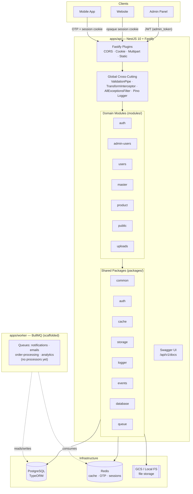
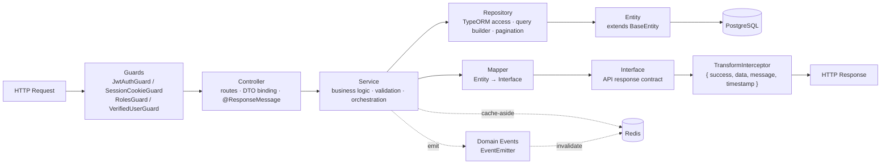
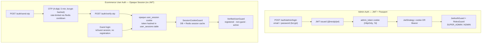
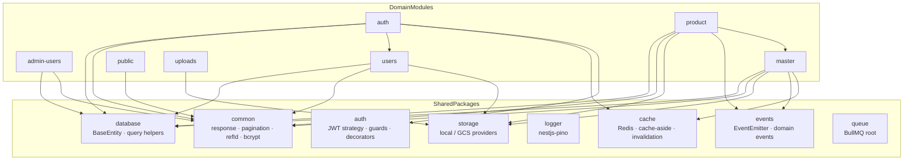
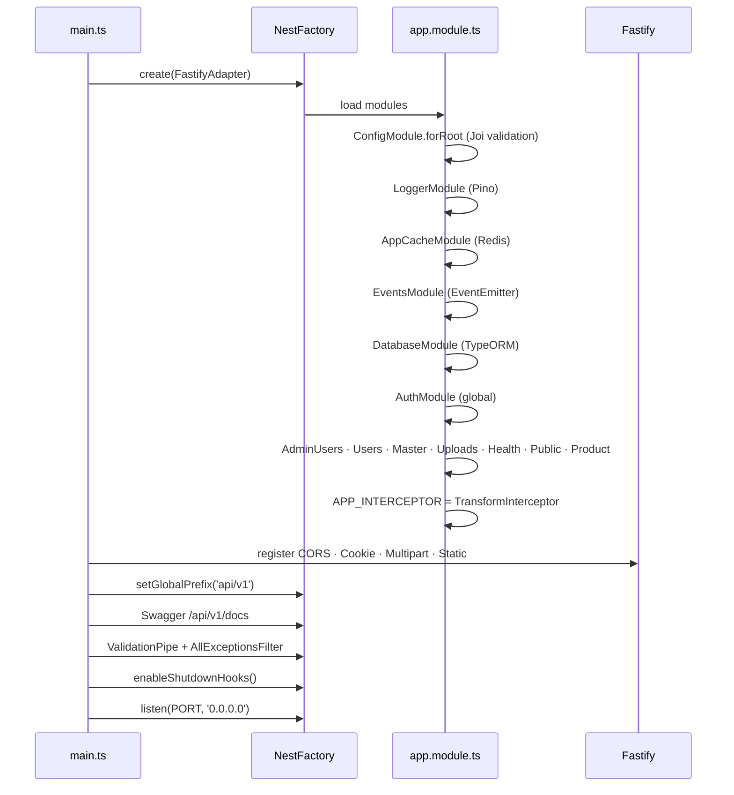

# Cureka Backend — Architecture Diagram

A production-grade **NestJS 10 modular monolith** running on **Fastify**, backed by **PostgreSQL (TypeORM)**, **Redis**, and pluggable **GCS / local** file storage. The repo is a Nest monorepo with two apps (`api`, `worker`), seven domain modules, and eight shared packages.

---

## 1. High-Level System Architecture

---

## 2. Request Flow — Layered Architecture

Every module follows the same strict layering. Controllers are thin, services hold business logic, repositories own all DB access, and entities are **never** exposed directly — mappers convert them to interface contracts.

---

## 3. Dual Authentication Model

Admin and ecommerce-user authentication are intentionally separate systems.

> Note: SMS / email delivery is **not yet integrated** — OTP defaults to `1234` in dev and is returned in the API response for non-production testing.

---

## 4. Module ↔ Package Dependencies

---

## 5. Bootstrap Sequence (`apps/api`)

---

## Stack Reference

| Layer | Technology |
|-------|-----------|
| Framework | NestJS `^10.4.1` (monorepo) |
| HTTP adapter | Fastify `^4.28.1` |
| API prefix | `api/v1` |
| ORM / DB | TypeORM `^0.3.20` + PostgreSQL (`pg`) |
| Cache / sessions / OTP | Redis (in-memory fallback) |
| File storage | Google Cloud Storage / Local FS (`STORAGE_DRIVER`) |
| Admin auth | JWT (`@nestjs/jwt`, Passport) — `admin_token` cookie |
| User auth | Opaque session cookie + OTP |
| Validation | `class-validator` + global `ValidationPipe`; Joi for env |
| Docs | Swagger at `/api/v1/docs` |
| Logging | `nestjs-pino` (redacted) |
| Events | `@nestjs/event-emitter` (in-process) |
| Jobs | BullMQ (`apps/worker`, scaffolded) |
| Local dev | `docker-compose.dev.yml` — Postgres 16 + Redis 7 |
