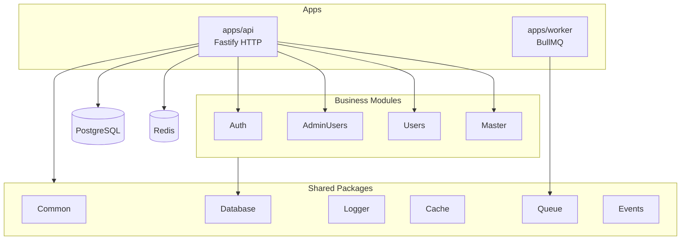

Here is a consolidated picture of **Cureka Backend** based on the codebase and all 24 markdown files.

---

## What this project is

A **production-grade NestJS modular monolith** (Fastify + TypeORM + PostgreSQL) designed so business modules can be extracted into microservices later. It is **not** a classic `src/` monolith — business logic lives at the repo root under `modules/`.

---

## Repository structure

```
cureka-backend/
├── apps/
│   ├── api/                    # Main HTTP app (Fastify)
│   │   ├── main.ts             # Bootstrap, CORS, cookies, global pipes/filters
│   │   ├── app.module.ts       # Wires all modules + global interceptor
│   │   ├── config/             # app, database, jwt config + Joi validation
│   │   ├── common/             # Shared API concerns (filters, interceptors, DTOs)
│   │   └── database/           # TypeORM module, migrations, seeds
│   └── worker/                 # BullMQ background job processor
│
├── modules/                    # Business domains (extraction-ready)
│   ├── auth/                   # Admin + user JWT auth
│   ├── admin-users/
│   ├── users/
│   └── master/                 # Attributes + categories
│
├── packages/                   # Shared internal libraries
│   ├── common/                 # API response, pagination, hash, constants
│   ├── database/               # BaseEntity, buildSkipTake
│   ├── logger/                 # nestjs-pino
│   ├── cache/                  # Redis cache
│   ├── queue/                  # BullMQ
│   └── events/                 # Domain event bus
│
├── docs/api.md                 # API module roadmap
├── infrastructure/             # Planned k8s/terraform/helm (not built yet)
└── .github/                    # AI agent governance, skills, instructions
```

---

## Current modules (what exists today)

| Module | Prefix | Status |
|--------|--------|--------|
| **Auth** | `/api/v1/auth/admin`, `/api/v1/auth/users` | Active — login/logout, JWT cookie + Bearer |
| **Admin Users** | `/api/v1/admin-users` | Active — CRUD, role-based |
| **Users** | `/api/v1/users` | Active — CRUD |
| **Master** | `/api/v1/master/attributes`, `/api/v1/master/categories` | Active — attributes + category tree |

**Planned** (from `docs/api.md`): products, inventory, cart, orders, payments, delivery, notifications, reviews, sellers, analytics.

**Migrations on disk:** initial schema → refId/updatedBy → attributes → categories → isInHeader/isInShopBy.

---

## Module anatomy (mandatory pattern)

Every business module follows this 9-folder layout:

```
modules/<name>/
├── controllers/     # Thin — routes, guards, DTO binding only
├── services/        # Business logic + orchestration
├── repositories/    # All TypeORM/DB access
├── entities/        # Extend BaseEntity
├── dto/             # Single <name>.dto.ts per module
├── interfaces/      # Response shapes (never expose raw entities)
├── enums/
├── mappers/         # Pure functions: entity → interface
├── utils/
└── <name>.module.ts
```

---

## Layer rules

| Layer | Does | Must NOT |
|-------|------|----------|
| **Controller** | HTTP, guards, validation | Business logic, DB access |
| **Service** | Rules, orchestration | Direct TypeORM queries |
| **Repository** | Queries, pagination, soft delete | HTTP exceptions, business rules |

---

## Cross-cutting concerns

**API prefix:** `/api/v1` (`APP_CONSTANTS.API_PREFIX`)

**Response envelope** (global `TransformInterceptor`):
```json
{ "success": true, "data": {}, "message": "...", "timestamp": "..." }
```

**Auth:**
- JWT from `admin_token` cookie **or** `Authorization: Bearer <token>`
- `@UseGuards(JwtAuthGuard, RolesGuard)` on protected routes
- Roles: `super_admin`, `admin`, etc.

**BaseEntity** (all entities):
- `id` (UUID), `refId`, `createdAt`, `updatedAt`, `updatedBy`, `deletedAt` (soft delete)

**Security:**
- bcrypt 12 rounds via `hashPassword()` / `comparePasswords()`
- `password` column always `select: false`
- `ParseUUIDPipe` on UUID params
- `synchronize: true` is **forbidden** — migrations only

**Logging:** nestjs-pino only — no `console.log`

**Path aliases:** `@modules/*`, `@packages/*`, `@config/*`, `@common/*`, `@database/*`

---

## Key env variables

| Variable | Purpose |
|----------|---------|
| `DATABASE_URL` | PostgreSQL connection |
| `JWT_SECRET` / `JWT_EXPIRES_IN` | Auth tokens |
| `PORT` | Default 3000 |
| `NODE_ENV` | development / production / staging / test |
| `CORS_ORIGINS` | Frontend origins (comma-separated) |
| `DATABASE_LOGGING` | `false` to suppress SQL query logs |
| `REDIS_HOST/PORT/PASSWORD` | Cache + queue |

**Seed admin:** `npm run seed:run` → `superadmin@cureka.com` / `Admin@1234`

---

## Dev commands

| Command | Purpose |
|---------|---------|
| `npm run dev` | Start API with watch |
| `npm run migration:generate -- apps/api/database/migrations/<Name>` | Generate migration |
| `npm run migration:run` | Apply migrations |
| `npm run seed:run` | Bootstrap super admin |
| `npm run lint` / `npx tsc --noEmit` | Quality gates |
| `npm run test` / `npm run test:e2e` | Tests |

---

## `.github/` — AI governance (for agents, not runtime)

The repo has a structured agent workflow:

| Agent | Role |
|-------|------|
| `@develop` | Feature implementation (Phases 0–12, design gate before coding) |
| `@code-review` | Read-only audit with Blocker/Warning/Nit severity |

**Non-negotiable rules** (`safety-guardrails.md`):
- No `synchronize: true`
- No secrets in code/commits
- No force push / hard reset
- Design confirmation required before writing files

**Instructions** scoped by file type:
- `service-layer.instructions.md` → `*.service.ts`
- `repository-pattern.instructions.md` → `*.repository.ts`
- `dto-validation.instructions.md` → `*.dto.ts`
- `migration-workflow.instructions.md` → migrations
- `tests.instructions.md` → `*.spec.ts`

---

## Architecture diagram



---

## Gaps / notes

1. **`docs/api.md` is outdated** — Auth and Master are active but still marked "Planned" in that file.
2. **`infrastructure/`** is placeholder only (k8s/terraform not implemented).
3. **Some instruction docs reference `@shared/utils`** — the actual package is `@packages/common` (naming drift in older docs).
4. **Worker app** exists but is minimal compared to the API.

---

I now have full context on structure, conventions, and active modules. If you want to build something next (e.g. products, fix `docs/api.md`, or scaffold a new module), say what to tackle.