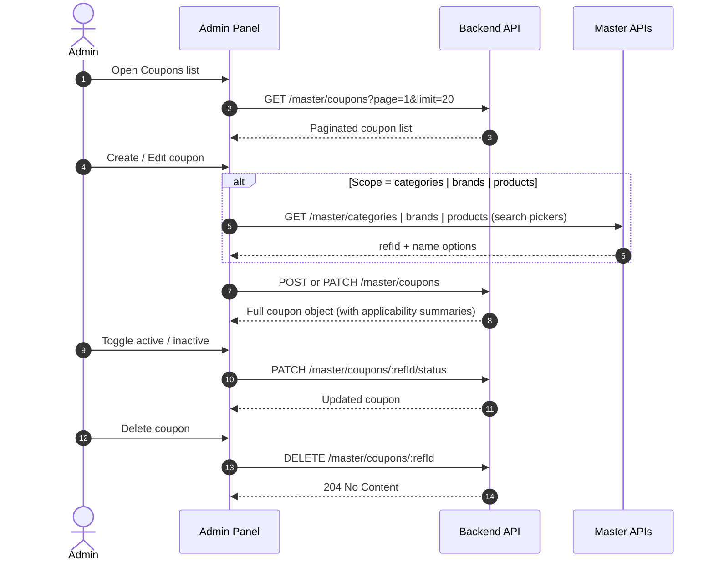

# Coupon Master — Admin Panel Integration Guide

This document describes how to integrate the **Coupon Master** module in the Cureka admin panel: authentication, API endpoints, request/response shapes, validation rules, and recommended UI flows.

**Backend module:** `modules/master` (`CouponsController`, `CouponsService`)  
**Swagger:** `/api/v1/docs` → **Coupons** (under Master)

---

## 1. Admin Panel Integration Flow



### Recommended screens

| Screen | Primary API | Notes |
|--------|-------------|-------|
| Coupon list | `GET /master/coupons` | Search, sort, pagination. Use `refId` for row actions. |
| Coupon detail / edit | `GET /master/coupons/:refId` | **Required for edit form** — list response does not include category/product/brand mappings. |
| Create coupon | `POST /master/coupons` | `SUPER_ADMIN` only. |
| Update coupon | `PATCH /master/coupons/:refId` | Partial update supported. |
| Status toggle | `PATCH /master/coupons/:refId/status` | Prefer this over full `PATCH` for enable/disable. |
| Delete coupon | `DELETE /master/coupons/:refId` | Soft delete. `SUPER_ADMIN` only. |

---

## 2. Base URL & Authentication

```
Development   http://localhost:3000/api/v1
Staging       https://staging-api.cureka.com/api/v1
Production    https://api.cureka.com/api/v1
```

All coupon endpoints require admin authentication:

```http
Authorization: Bearer <ADMIN_JWT_TOKEN>
```

Cookie-based auth (`admin_token`) is also supported if configured in your admin app.

### Role access

| Endpoint | `super_admin` | `admin` |
|----------|:-------------:|:-------:|
| `POST /master/coupons` | ✅ | ❌ |
| `GET /master/coupons` | ✅ | ✅ |
| `GET /master/coupons/:refId` | ✅ | ✅ |
| `PATCH /master/coupons/:refId` | ✅ | ✅ |
| `PATCH /master/coupons/:refId/status` | ✅ | ✅ |
| `DELETE /master/coupons/:refId` | ✅ | ❌ |

---

## 3. Standard Response Envelope

Successful responses use the global API wrapper:

```json
{
  "success": true,
  "message": "Coupons retrieved successfully",
  "data": { }
}
```

Paginated list responses place pagination metadata inside `data`:

```json
{
  "success": true,
  "message": "Coupons retrieved successfully",
  "data": {
    "data": [ ],
    "total": 42,
    "page": 1,
    "limit": 20,
    "totalPages": 3,
    "hasNextPage": true,
    "hasPreviousPage": false
  }
}
```

Error responses (4xx) follow the same envelope with `success: false` and an error `message`.

---

## 4. API Reference

### 4.1 List coupons

| | |
|---|---|
| **Method** | `GET` |
| **Path** | `/master/coupons` |
| **Roles** | `super_admin`, `admin` |
| **Success** | `200 OK` |

**Query parameters**

| Param | Type | Default | Description |
|-------|------|---------|-------------|
| `page` | number | `1` | Page number (min 1) |
| `limit` | number | `20` | Page size (1–100) |
| `search` | string | — | Matches `title`, `code`, or `couponType` (case-insensitive) |
| `sortBy` | string | `createdAt` | One of: `createdAt`, `title`, `code`, `couponType`, `startDate`, `expiryDate`, `status` |
| `sortOrder` | `ASC` \| `DESC` | `DESC` | Sort direction |

**Example**

```http
GET /api/v1/master/coupons?page=1&limit=20&search=SUMMER&sortBy=expiryDate&sortOrder=ASC
Authorization: Bearer <TOKEN>
```

> **Note:** The list endpoint returns core coupon fields only. `categories`, `products`, and `brands` arrays are empty on list items. Load `GET /master/coupons/:refId` before populating an edit form.

---

### 4.2 Get coupon by refId

| | |
|---|---|
| **Method** | `GET` |
| **Path** | `/master/coupons/:refId` |
| **Roles** | `super_admin`, `admin` |
| **Success** | `200 OK` |

**Example**

```http
GET /api/v1/master/coupons/COU20260001
Authorization: Bearer <TOKEN>
```

**Success response (`data`)**

```json
{
  "id": "a1b2c3d4-e5f6-7890-abcd-ef1234567890",
  "refId": "COU20260001",
  "couponType": "Seasonal",
  "title": "Summer Sale 10% Off",
  "code": "SUMMER10",
  "sameUserLimit": 1,
  "discountType": "percentage",
  "discountAmount": 10,
  "minPurchase": 500,
  "maxDiscount": 200,
  "startDate": "2026-06-01T00:00:00.000Z",
  "expiryDate": "2026-08-31T23:59:59.000Z",
  "applicabilityScope": "categories",
  "categories": [
    { "refId": "CAT20260012", "name": "Vitamins" }
  ],
  "products": [],
  "brands": [],
  "status": "active",
  "createdBy": "admin@cureka.com",
  "updatedBy": "admin@cureka.com",
  "createdAt": "2026-05-15T10:30:00.000Z",
  "updatedAt": "2026-05-20T14:00:00.000Z"
}
```

---

### 4.3 Create coupon

| | |
|---|---|
| **Method** | `POST` |
| **Path** | `/master/coupons` |
| **Roles** | `super_admin` only |
| **Success** | `201 Created` |
| **Message** | `Coupon created successfully` |

**Request body**

```json
{
  "couponType": "Seasonal",
  "title": "Summer Sale 10% Off",
  "code": "summer10",
  "sameUserLimit": 1,
  "discountType": "percentage",
  "discountAmount": 10,
  "minPurchase": 500,
  "maxDiscount": 200,
  "startDate": "2026-06-01T00:00:00.000Z",
  "expiryDate": "2026-08-31T23:59:59.000Z",
  "applicabilityScope": "categories",
  "categoryRefIds": ["CAT20260012", "CAT20260015"],
  "status": "active"
}
```

**Field reference**

| Field | Required | Type | Notes |
|-------|:--------:|------|-------|
| `couponType` | ✅ | string (max 100) | Free-text label (e.g. `Seasonal`, `Welcome`, `Flash`) — not an enum |
| `title` | ✅ | string (max 255) | Display name |
| `code` | ✅ | string (max 100) | Stored uppercase; duplicates rejected |
| `sameUserLimit` | — | integer \| `null` | Min 1 when set; `null` = unlimited per user |
| `discountType` | ✅ | `fixed` \| `percentage` | See [Discount types](#6-discount-types) |
| `discountAmount` | ✅ | number | For `percentage`, max 100 |
| `minPurchase` | — | number | Default `0`; minimum eligible cart subtotal |
| `maxDiscount` | — | number \| `null` | Caps discount for percentage coupons; must be > 0 if set |
| `startDate` | ✅ | ISO 8601 date | Must be before `expiryDate` |
| `expiryDate` | ✅ | ISO 8601 date | Must be after `startDate` |
| `applicabilityScope` | — | enum | Default `all` — see [Applicability scope](#7-applicability-scope) |
| `categoryRefIds` | — | string[] | Required when scope is `categories` |
| `productRefIds` | — | string[] | Required when scope is `products` |
| `brandRefIds` | — | string[] | Required when scope is `brands` |
| `status` | — | `active` \| `inactive` | Default `active` |

---

### 4.4 Update coupon

| | |
|---|---|
| **Method** | `PATCH` |
| **Path** | `/master/coupons/:refId` |
| **Roles** | `super_admin`, `admin` |
| **Success** | `200 OK` |
| **Message** | `Coupon updated successfully` |

All fields from create are optional (partial update). Send only fields that changed.

**Applicability update behavior**

- Mappings are re-synced only when `applicabilityScope`, `categoryRefIds`, `productRefIds`, or `brandRefIds` is present in the body.
- Changing scope clears mappings that no longer apply.
- Omitting ref-id arrays while changing scope on update keeps existing mappings for the new scope (server merges from DB).

**Example — change to fixed discount on all products**

```json
{
  "discountType": "fixed",
  "discountAmount": 100,
  "maxDiscount": null,
  "applicabilityScope": "all",
  "categoryRefIds": [],
  "productRefIds": [],
  "brandRefIds": []
}
```

---

### 4.5 Update coupon status

| | |
|---|---|
| **Method** | `PATCH` |
| **Path** | `/master/coupons/:refId/status` |
| **Roles** | `super_admin`, `admin` |
| **Success** | `200 OK` |
| **Message** | `Coupon status updated successfully` |

**Request body**

```json
{
  "status": "inactive"
}
```

Use this endpoint for enable/disable toggles in the list or detail UI.

---

### 4.6 Delete coupon

| | |
|---|---|
| **Method** | `DELETE` |
| **Path** | `/master/coupons/:refId` |
| **Roles** | `super_admin` only |
| **Success** | `204 No Content` |
| **Message** | `Coupon deleted successfully` |

Performs a **soft delete** (`deletedAt` is set). Deleted coupons are not returned in admin list/detail queries and cannot be applied at checkout.

---

## 5. Supporting Master APIs (Pickers)

When `applicabilityScope` is not `all`, the create/edit form needs searchable pickers. Use existing master list endpoints:

| Scope | Picker API | Value sent to coupon API |
|-------|------------|--------------------------|
| `categories` | `GET /master/categories` | `categoryRefIds[]` |
| `brands` | `GET /master/brands` | `brandRefIds[]` |
| `products` | `GET /api/v1/products` | `productRefIds[]` |

All references use **refId** (e.g. `CAT20260012`), not internal UUIDs.

Invalid or missing refIds return `404` with a message like `Category(s) not found: CAT99999999`.

---

## 6. Discount Types

| `discountType` | `discountAmount` meaning | `maxDiscount` |
|----------------|--------------------------|---------------|
| `fixed` | Flat rupee discount off eligible subtotal | Optional cap (uncommon for fixed) |
| `percentage` | Percentage off eligible subtotal (0–100) | Recommended cap for large carts |

**Checkout calculation (for reference)**

1. Determine eligible subtotal based on `applicabilityScope`.
2. Verify `minPurchase` against eligible subtotal.
3. Compute discount: `fixed` → flat amount; `percentage` → `(subtotal × amount) / 100`.
4. Cap at eligible subtotal and at `maxDiscount` when set.

---

## 7. Applicability Scope

| `applicabilityScope` | Allowed ref-id fields | Checkout behavior |
|----------------------|----------------------|-------------------|
| `all` | None (must be empty or omitted) | Discount applies to full cart subtotal |
| `categories` | `categoryRefIds` only | Discount on items in selected categories |
| `products` | `productRefIds` only | Discount on selected products only |
| `brands` | `brandRefIds` only | Discount on items from selected brands |

**Validation rules**

- When scope is `all`, do not send non-empty `categoryRefIds`, `productRefIds`, or `brandRefIds`.
- When scope is `categories`, only `categoryRefIds` may be non-empty.
- When scope is `products`, only `productRefIds` may be non-empty.
- When scope is `brands`, only `brandRefIds` may be non-empty.

---

## 8. Validation & Error Handling

| Condition | HTTP | Example message |
|-----------|------|-----------------|
| Duplicate coupon code | `409 Conflict` | `Coupon code "SUMMER10" already exists` |
| `expiryDate` ≤ `startDate` | `400 Bad Request` | `expiryDate must be after startDate` |
| Percentage > 100 | `400 Bad Request` | `discountAmount cannot exceed 100 for percentage discounts` |
| `maxDiscount` ≤ 0 | `400 Bad Request` | `maxDiscount must be greater than 0 when provided` |
| Invalid applicability refIds | `400 Bad Request` | Scope / ref-id mismatch messages |
| Missing master refId | `404 Not Found` | `Category(s) not found: CAT...` |
| Coupon not found | `404 Not Found` | `Coupon with refId COU... not found` |
| DTO validation failure | `400 Bad Request` | Field-level validation errors |
| Unauthorized / forbidden role | `401` / `403` | Standard auth errors |

**Code normalization:** `code` is trimmed and uppercased server-side (`summer10` → `SUMMER10`).

---

## 9. Admin UI Recommendations

### List table columns

- Code, title, coupon type
- Discount (`10%` or `₹100 fixed`)
- Validity (`startDate` – `expiryDate`)
- Scope (`All`, `Categories`, etc.)
- Status badge (`active` / `inactive`)
- Actions: View/Edit, Toggle status, Delete (super admin only)

### Create / edit form sections

1. **Basic info** — type, title, code, status
2. **Discount** — type, amount, min purchase, max discount (show max discount field only for percentage)
3. **Validity** — start & expiry datetime pickers (send ISO 8601)
4. **Usage limit** — same-user limit (optional; empty = unlimited)
5. **Applicability** — scope selector + multi-select picker (conditional)

### Form UX tips

- Validate `expiryDate > startDate` client-side before submit.
- For percentage discounts, enforce `discountAmount ≤ 100` in the UI.
- Disable ref-id pickers when scope is `all`.
- On edit, always fetch `GET /master/coupons/:refId` to hydrate mappings.
- Show inactive coupons in the list but visually distinguish them; checkout ignores inactive coupons.

### Status values

| Value | Meaning |
|-------|---------|
| `active` | Coupon can be applied at checkout (within date range) |
| `inactive` | Coupon hidden from checkout; retained in admin for history |

---

## 10. Checkout Integration (Context)

Coupon management in admin is separate from checkout, but useful for testing:

- Customers apply coupons via cart/checkout APIs using the **coupon code** (not refId).
- At checkout the backend validates: status, date range, min purchase, per-user limit, and applicability against cart items.
- Usage is recorded in `coupon_usages` when an order is placed.

After creating a coupon in admin, test it end-to-end by applying the **code** in a staging cart before go-live.

---

## 11. Related Files

| Area | Path |
|------|------|
| Controller | `modules/master/controllers/coupons.controller.ts` |
| Service | `modules/master/services/coupons.service.ts` |
| DTOs | `modules/master/dto/coupon.dto.ts` |
| Response interface | `modules/master/interfaces/coupon.interface.ts` |
| Entity | `modules/master/entities/coupon.entity.ts` |
| Checkout validation | `modules/orders/services/coupon-checkout.service.ts` |
