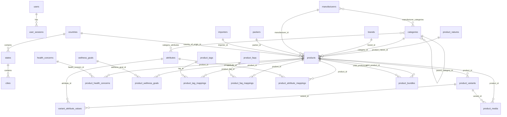
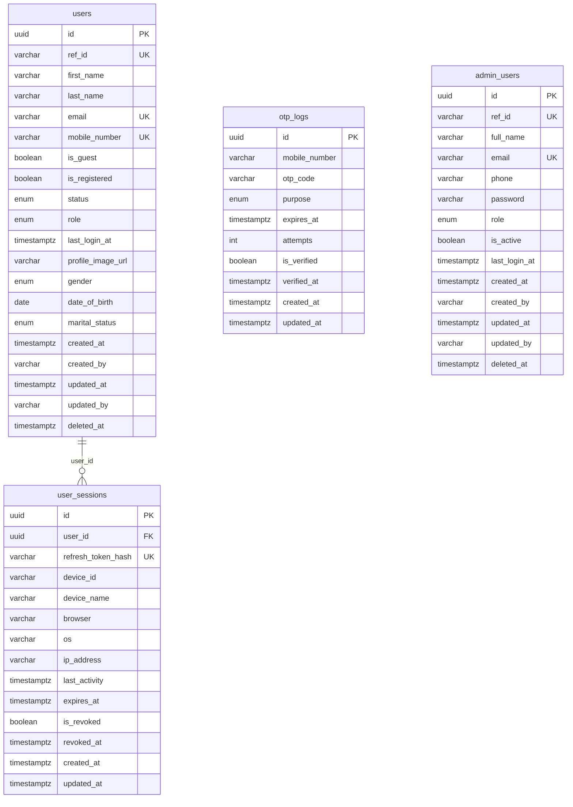
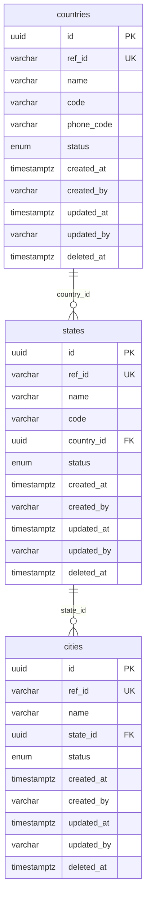
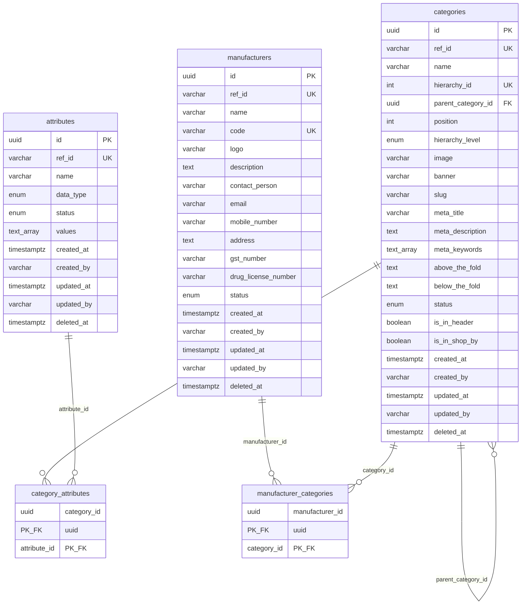
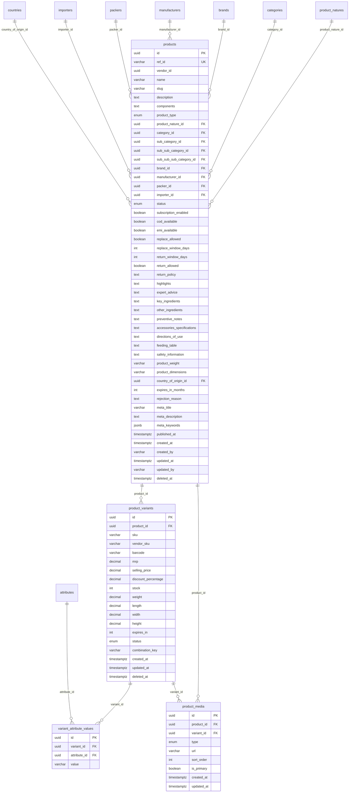
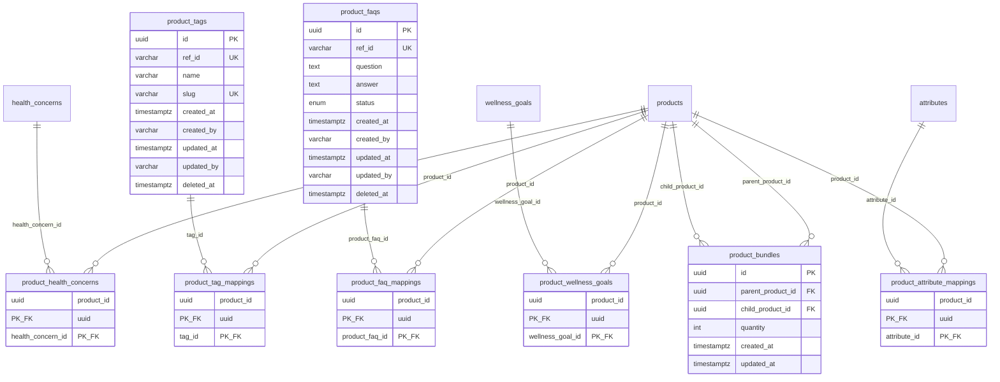

# Cureka Database — Entity Relationship Diagram

Generated from TypeORM entities and migrations in this repository.

**Database:** PostgreSQL  
**ORM:** TypeORM  
**Total tables:** 33  
**Column naming:** All field names below use **database column names** (`snake_case`).

---

## Conventions

### BaseEntity columns

These 7 columns appear on every table marked **BaseEntity** below (listed once here, included in each table's field reference):

| Column | Type | Nullable | Notes |
|--------|------|----------|-------|
| `id` | UUID | No | Primary key |
| `ref_id` | VARCHAR(11) | No | Unique public reference |
| `created_at` | TIMESTAMPTZ | No | Auto-set on insert |
| `created_by` | VARCHAR(255) | Yes | Audit |
| `updated_at` | TIMESTAMPTZ | No | Auto-updated |
| `updated_by` | VARCHAR(255) | Yes | Audit |
| `deleted_at` | TIMESTAMPTZ | Yes | Soft delete |

Tables **without** BaseEntity: `user_sessions`, `otp_logs`, `product_variants`, `variant_attribute_values`, `product_media`, `product_bundles`, and all composite-PK junction tables.

---

## High-Level Overview

---

## Auth & Users

---

## Geography

---

## Categories, Attributes & Manufacturers

---

## Master Reference Data

```mermaid
erDiagram
  brands {
    uuid id PK
    varchar ref_id UK
    varchar name
    varchar slug UK
    varchar logo
    varchar banner
    text description
    enum status
    varchar meta_title
    text meta_description
    text_array meta_keywords
    timestamptz created_at
    varchar created_by
    timestamptz updated_at
    varchar updated_by
    timestamptz deleted_at
  }

  packers {
    uuid id PK
    varchar ref_id UK
    varchar name
    varchar code UK
    varchar logo
    text description
    varchar contact_person
    varchar email
    varchar mobile_number
    text address
    varchar gst_number
    varchar drug_license_number
    enum status
    text remarks
    timestamptz created_at
    varchar created_by
    timestamptz updated_at
    varchar updated_by
    timestamptz deleted_at
  }

  importers {
    uuid id PK
    varchar ref_id UK
    varchar name
    varchar code UK
    varchar iec
    varchar logo
    varchar contact_person
    varchar email
    varchar mobile_number
    text address
    varchar gst_number
    varchar drug_license_number
    enum status
    timestamptz created_at
    varchar created_by
    timestamptz updated_at
    varchar updated_by
    timestamptz deleted_at
  }

  product_natures {
    uuid id PK
    varchar ref_id UK
    varchar name
    enum status
    timestamptz created_at
    varchar created_by
    timestamptz updated_at
    varchar updated_by
    timestamptz deleted_at
  }

  health_concerns {
    uuid id PK
    varchar ref_id UK
    varchar name
    varchar icon
    varchar slug UK
    text description
    varchar banner
    enum status
    timestamptz created_at
    varchar created_by
    timestamptz updated_at
    varchar updated_by
    timestamptz deleted_at
  }

  wellness_goals {
    uuid id PK
    varchar ref_id UK
    varchar name
    varchar image
    enum status
    timestamptz created_at
    varchar created_by
    timestamptz updated_at
    varchar updated_by
    timestamptz deleted_at
  }

  age_groups {
    uuid id PK
    varchar ref_id UK
    varchar name
    int from_years
    int from_months
    int to_years
    int to_months
    enum status
    timestamptz created_at
    varchar created_by
    timestamptz updated_at
    varchar updated_by
    timestamptz deleted_at
  }

  subscription_frequencies {
    uuid id PK
    varchar ref_id UK
    varchar name
    int value
    enum unit
    enum status
    timestamptz created_at
    varchar created_by
    timestamptz updated_at
    varchar updated_by
    timestamptz deleted_at
  }

  banners {
    uuid id PK
    varchar ref_id UK
    enum placement
    enum slot
    enum resource_type
    varchar resource_ref_id
    varchar external_url
    varchar title
    varchar image_url
    int sort_order
    enum status
    timestamptz starts_at
    timestamptz ends_at
    timestamptz created_at
    varchar created_by
    timestamptz updated_at
    varchar updated_by
    timestamptz deleted_at
  }
```

> `banners.resource_ref_id` is a soft reference (by `ref_id`) — not enforced by a database FK.

---

## Products (Core Catalog)

---

## Products (Mappings & Bundles)

---

## Complete Field Reference

Every column for every table. **BE** = includes BaseEntity columns (`id`, `ref_id`, `created_at`, `created_by`, `updated_at`, `updated_by`, `deleted_at`).

### `admin_users` (BE)

| Column | Type | Nullable | Key |
|--------|------|----------|-----|
| `full_name` | VARCHAR(255) | No | |
| `email` | VARCHAR(255) | No | UK |
| `phone` | VARCHAR(20) | Yes | |
| `password` | VARCHAR(255) | No | |
| `role` | ENUM | No | |
| `is_active` | BOOLEAN | No | default true |
| `last_login_at` | TIMESTAMPTZ | Yes | |

### `age_groups` (BE)

| Column | Type | Nullable | Key |
|--------|------|----------|-----|
| `name` | VARCHAR(255) | No | |
| `from_years` | INT | No | |
| `from_months` | INT | No | |
| `to_years` | INT | No | |
| `to_months` | INT | No | |
| `status` | ENUM | No | |

### `attributes` (BE)

| Column | Type | Nullable | Key |
|--------|------|----------|-----|
| `name` | VARCHAR(255) | No | |
| `data_type` | ENUM | Yes | |
| `status` | ENUM | No | |
| `values` | TEXT[] | Yes | |

### `banners` (BE)

| Column | Type | Nullable | Key |
|--------|------|----------|-----|
| `placement` | ENUM | No | |
| `slot` | ENUM | No | |
| `resource_type` | ENUM | No | |
| `resource_ref_id` | VARCHAR(11) | Yes | soft ref |
| `external_url` | VARCHAR(2000) | Yes | |
| `title` | VARCHAR(255) | No | |
| `image_url` | VARCHAR(500) | No | |
| `sort_order` | INT | No | default 0 |
| `status` | ENUM | No | |
| `starts_at` | TIMESTAMPTZ | Yes | |
| `ends_at` | TIMESTAMPTZ | Yes | |

### `brands` (BE)

| Column | Type | Nullable | Key |
|--------|------|----------|-----|
| `name` | VARCHAR(255) | No | |
| `slug` | VARCHAR(300) | No | UK |
| `logo` | VARCHAR(500) | Yes | |
| `banner` | VARCHAR(500) | Yes | |
| `description` | TEXT | Yes | |
| `status` | ENUM | No | |
| `meta_title` | VARCHAR(255) | Yes | |
| `meta_description` | TEXT | Yes | |
| `meta_keywords` | TEXT[] | Yes | |

### `categories` (BE)

| Column | Type | Nullable | Key |
|--------|------|----------|-----|
| `name` | VARCHAR(255) | No | |
| `hierarchy_id` | INT | No | UK |
| `parent_category_id` | UUID | Yes | FK → categories.id |
| `position` | INT | No | default 0 |
| `hierarchy_level` | ENUM | No | |
| `image` | VARCHAR(500) | Yes | |
| `banner` | VARCHAR(500) | Yes | |
| `slug` | VARCHAR(300) | No | |
| `meta_title` | VARCHAR(255) | Yes | |
| `meta_description` | TEXT | Yes | |
| `meta_keywords` | TEXT[] | Yes | |
| `above_the_fold` | TEXT | Yes | |
| `below_the_fold` | TEXT | Yes | |
| `status` | ENUM | No | |
| `is_in_header` | BOOLEAN | No | default false |
| `is_in_shop_by` | BOOLEAN | No | default false; Show on homepage (Shop by Category) for root, sub, and sub-sub |

### `category_attributes` (junction)

| Column | Type | Nullable | Key |
|--------|------|----------|-----|
| `category_id` | UUID | No | PK, FK → categories.id |
| `attribute_id` | UUID | No | PK, FK → attributes.id |

### `cities` (BE)

| Column | Type | Nullable | Key |
|--------|------|----------|-----|
| `name` | VARCHAR(255) | No | |
| `state_id` | UUID | No | FK → states.id |
| `status` | ENUM | No | |

### `countries` (BE)

| Column | Type | Nullable | Key |
|--------|------|----------|-----|
| `name` | VARCHAR(255) | No | |
| `code` | VARCHAR(3) | No | |
| `phone_code` | VARCHAR(10) | Yes | |
| `status` | ENUM | No | |

### `health_concerns` (BE)

| Column | Type | Nullable | Key |
|--------|------|----------|-----|
| `name` | VARCHAR(255) | No | |
| `icon` | VARCHAR(500) | Yes | |
| `slug` | VARCHAR(300) | No | UK |
| `description` | TEXT | Yes | |
| `banner` | VARCHAR(500) | Yes | |
| `status` | ENUM | No | |

### `importers` (BE)

| Column | Type | Nullable | Key |
|--------|------|----------|-----|
| `name` | VARCHAR(255) | No | |
| `code` | VARCHAR(100) | No | UK |
| `iec` | VARCHAR(100) | Yes | |
| `logo` | VARCHAR(500) | Yes | |
| `contact_person` | VARCHAR(255) | Yes | |
| `email` | VARCHAR(255) | Yes | |
| `mobile_number` | VARCHAR(20) | Yes | |
| `address` | TEXT | Yes | |
| `gst_number` | VARCHAR(50) | Yes | |
| `drug_license_number` | VARCHAR(100) | Yes | |
| `status` | ENUM | No | |

### `manufacturer_categories` (junction)

| Column | Type | Nullable | Key |
|--------|------|----------|-----|
| `manufacturer_id` | UUID | No | PK, FK → manufacturers.id |
| `category_id` | UUID | No | PK, FK → categories.id |

### `manufacturers` (BE)

| Column | Type | Nullable | Key |
|--------|------|----------|-----|
| `name` | VARCHAR(255) | No | |
| `code` | VARCHAR(100) | No | UK |
| `logo` | VARCHAR(500) | Yes | |
| `description` | TEXT | Yes | |
| `contact_person` | VARCHAR(255) | Yes | |
| `email` | VARCHAR(255) | Yes | |
| `mobile_number` | VARCHAR(20) | Yes | |
| `address` | TEXT | Yes | |
| `gst_number` | VARCHAR(50) | Yes | |
| `drug_license_number` | VARCHAR(100) | Yes | |
| `status` | ENUM | No | |

### `otp_logs`

| Column | Type | Nullable | Key |
|--------|------|----------|-----|
| `id` | UUID | No | PK |
| `mobile_number` | VARCHAR(20) | No | |
| `otp_code` | VARCHAR(255) | No | bcrypt hash |
| `purpose` | ENUM | No | |
| `expires_at` | TIMESTAMPTZ | No | |
| `attempts` | INT | No | default 0 |
| `is_verified` | BOOLEAN | No | default false |
| `verified_at` | TIMESTAMPTZ | Yes | |
| `created_at` | TIMESTAMPTZ | No | |
| `updated_at` | TIMESTAMPTZ | No | |

### `packers` (BE)

| Column | Type | Nullable | Key |
|--------|------|----------|-----|
| `name` | VARCHAR(255) | No | |
| `code` | VARCHAR(100) | No | UK |
| `logo` | VARCHAR(500) | Yes | |
| `description` | TEXT | Yes | |
| `contact_person` | VARCHAR(255) | Yes | |
| `email` | VARCHAR(255) | Yes | |
| `mobile_number` | VARCHAR(20) | Yes | |
| `address` | TEXT | Yes | |
| `gst_number` | VARCHAR(50) | Yes | |
| `drug_license_number` | VARCHAR(100) | Yes | |
| `status` | ENUM | No | |
| `remarks` | TEXT | Yes | |

### `product_attribute_mappings` (junction)

| Column | Type | Nullable | Key |
|--------|------|----------|-----|
| `product_id` | UUID | No | PK, FK → products.id |
| `attribute_id` | UUID | No | PK, FK → attributes.id |

### `product_bundles`

| Column | Type | Nullable | Key |
|--------|------|----------|-----|
| `id` | UUID | No | PK |
| `parent_product_id` | UUID | No | FK → products.id |
| `child_product_id` | UUID | No | FK → products.id |
| `quantity` | INT | No | default 1 |
| `created_at` | TIMESTAMPTZ | No | |
| `updated_at` | TIMESTAMPTZ | No | |

Unique: (`parent_product_id`, `child_product_id`)

### `product_faq_mappings` (junction)

| Column | Type | Nullable | Key |
|--------|------|----------|-----|
| `product_id` | UUID | No | PK, FK → products.id |
| `product_faq_id` | UUID | No | PK, FK → product_faqs.id |

### `product_faqs` (BE)

| Column | Type | Nullable | Key |
|--------|------|----------|-----|
| `question` | TEXT | No | |
| `answer` | TEXT | No | |
| `status` | ENUM | No | |

### `product_health_concerns` (junction)

| Column | Type | Nullable | Key |
|--------|------|----------|-----|
| `product_id` | UUID | No | PK, FK → products.id |
| `health_concern_id` | UUID | No | PK, FK → health_concerns.id |

### `product_media`

| Column | Type | Nullable | Key |
|--------|------|----------|-----|
| `id` | UUID | No | PK |
| `product_id` | UUID | No | FK → products.id |
| `variant_id` | UUID | Yes | FK → product_variants.id |
| `type` | ENUM | No | |
| `url` | VARCHAR(1000) | No | |
| `sort_order` | INT | No | default 0 |
| `is_primary` | BOOLEAN | No | default false |
| `created_at` | TIMESTAMPTZ | No | |
| `updated_at` | TIMESTAMPTZ | No | |

### `product_natures` (BE)

| Column | Type | Nullable | Key |
|--------|------|----------|-----|
| `name` | VARCHAR(255) | No | |
| `status` | ENUM | No | |

### `product_tag_mappings` (junction)

| Column | Type | Nullable | Key |
|--------|------|----------|-----|
| `product_id` | UUID | No | PK, FK → products.id |
| `tag_id` | UUID | No | PK, FK → product_tags.id |

### `product_tags` (BE)

| Column | Type | Nullable | Key |
|--------|------|----------|-----|
| `name` | VARCHAR(255) | No | |
| `slug` | VARCHAR(300) | No | UK |

### `product_variants`

| Column | Type | Nullable | Key |
|--------|------|----------|-----|
| `id` | UUID | No | PK |
| `product_id` | UUID | No | FK → products.id |
| `sku` | VARCHAR(100) | No | |
| `vendor_sku` | VARCHAR(100) | Yes | |
| `barcode` | VARCHAR(100) | Yes | |
| `mrp` | DECIMAL(12,2) | No | |
| `selling_price` | DECIMAL(12,2) | No | |
| `discount_percentage` | DECIMAL(5,2) | Yes | |
| `stock` | INT | No | default 0 |
| `weight` | DECIMAL(10,3) | Yes | |
| `length` | DECIMAL(10,2) | Yes | |
| `width` | DECIMAL(10,2) | Yes | |
| `height` | DECIMAL(10,2) | Yes | |
| `expires_in` | INT | Yes | |
| `status` | ENUM | No | |
| `combination_key` | VARCHAR(500) | Yes | |
| `created_at` | TIMESTAMPTZ | No | |
| `updated_at` | TIMESTAMPTZ | No | |
| `deleted_at` | TIMESTAMPTZ | Yes | soft delete |

### `product_wellness_goals` (junction)

| Column | Type | Nullable | Key |
|--------|------|----------|-----|
| `product_id` | UUID | No | PK, FK → products.id |
| `wellness_goal_id` | UUID | No | PK, FK → wellness_goals.id |

### `products` (BE)

| Column | Type | Nullable | Key |
|--------|------|----------|-----|
| `vendor_id` | UUID | Yes | no FK yet |
| `name` | VARCHAR(500) | No | |
| `slug` | VARCHAR(500) | No | |
| `description` | TEXT | Yes | |
| `components` | TEXT | Yes | |
| `product_type` | ENUM | No | |
| `product_nature_id` | UUID | Yes | FK → product_natures.id |
| `category_id` | UUID | No | FK → categories.id |
| `sub_category_id` | UUID | Yes | FK → categories.id |
| `sub_sub_category_id` | UUID | Yes | FK → categories.id |
| `sub_sub_sub_category_id` | UUID | Yes | FK → categories.id |
| `brand_id` | UUID | Yes | FK → brands.id |
| `manufacturer_id` | UUID | Yes | FK → manufacturers.id |
| `packer_id` | UUID | Yes | FK → packers.id |
| `importer_id` | UUID | Yes | FK → importers.id |
| `status` | ENUM | No | default draft |
| `subscription_enabled` | BOOLEAN | No | default false |
| `cod_available` | BOOLEAN | No | default false |
| `emi_available` | BOOLEAN | No | default false |
| `replace_allowed` | BOOLEAN | No | default false |
| `replace_window_days` | INT | Yes | |
| `return_window_days` | INT | Yes | |
| `return_allowed` | BOOLEAN | No | default false |
| `return_policy` | TEXT | Yes | |
| `highlights` | TEXT | Yes | |
| `expert_advice` | TEXT | Yes | |
| `key_ingredients` | TEXT | Yes | |
| `other_ingredients` | TEXT | Yes | |
| `preventive_notes` | TEXT | Yes | |
| `accessories_specifications` | TEXT | Yes | |
| `directions_of_use` | TEXT | Yes | |
| `feeding_table` | TEXT | Yes | |
| `safety_information` | TEXT | Yes | |
| `product_weight` | VARCHAR(100) | Yes | |
| `product_dimensions` | VARCHAR(100) | Yes | |
| `country_of_origin_id` | UUID | Yes | FK → countries.id |
| `expires_in_months` | INT | Yes | |
| `rejection_reason` | TEXT | Yes | |
| `meta_title` | VARCHAR(255) | Yes | |
| `meta_description` | TEXT | Yes | |
| `meta_keywords` | JSONB | Yes | |
| `published_at` | TIMESTAMPTZ | Yes | |

### `states` (BE)

| Column | Type | Nullable | Key |
|--------|------|----------|-----|
| `name` | VARCHAR(255) | No | |
| `code` | VARCHAR(10) | Yes | |
| `country_id` | UUID | No | FK → countries.id |
| `status` | ENUM | No | |

### `subscription_frequencies` (BE)

| Column | Type | Nullable | Key |
|--------|------|----------|-----|
| `name` | VARCHAR(255) | No | |
| `value` | INT | No | |
| `unit` | ENUM | No | |
| `status` | ENUM | No | |

### `user_sessions`

| Column | Type | Nullable | Key |
|--------|------|----------|-----|
| `id` | UUID | No | PK |
| `user_id` | UUID | No | FK → users.id |
| `refresh_token_hash` | VARCHAR(64) | No | UK |
| `device_id` | VARCHAR(64) | No | |
| `device_name` | VARCHAR(120) | Yes | |
| `browser` | VARCHAR(80) | Yes | |
| `os` | VARCHAR(80) | Yes | |
| `ip_address` | VARCHAR(45) | Yes | |
| `last_activity` | TIMESTAMPTZ | No | |
| `expires_at` | TIMESTAMPTZ | No | |
| `is_revoked` | BOOLEAN | No | default false |
| `revoked_at` | TIMESTAMPTZ | Yes | |
| `created_at` | TIMESTAMPTZ | No | |
| `updated_at` | TIMESTAMPTZ | No | |

### `users` (BE)

| Column | Type | Nullable | Key |
|--------|------|----------|-----|
| `first_name` | VARCHAR(100) | Yes | |
| `last_name` | VARCHAR(100) | Yes | |
| `email` | VARCHAR(255) | Yes | UK (partial) |
| `mobile_number` | VARCHAR(20) | Yes | UK (partial) |
| `is_guest` | BOOLEAN | No | default false |
| `is_registered` | BOOLEAN | No | default false |
| `status` | ENUM | No | |
| `role` | ENUM | No | |
| `last_login_at` | TIMESTAMPTZ | Yes | |
| `profile_image_url` | VARCHAR(500) | Yes | |
| `gender` | ENUM | Yes | |
| `date_of_birth` | DATE | Yes | |
| `marital_status` | ENUM | Yes | |

### `variant_attribute_values`

| Column | Type | Nullable | Key |
|--------|------|----------|-----|
| `id` | UUID | No | PK |
| `variant_id` | UUID | No | FK → product_variants.id |
| `attribute_id` | UUID | No | FK → attributes.id |
| `value` | VARCHAR(255) | No | |

Unique: (`variant_id`, `attribute_id`)

### `wellness_goals` (BE)

| Column | Type | Nullable | Key |
|--------|------|----------|-----|
| `name` | VARCHAR(255) | No | |
| `image` | VARCHAR(500) | Yes | |
| `status` | ENUM | No | |

---

## Table Index

| Table | Module | BaseEntity | Relationships |
|-------|--------|------------|---------------|
| `admin_users` | admin-users | Yes | — |
| `age_groups` | master | Yes | — |
| `attributes` | master | Yes | ↔ categories, products, variants |
| `banners` | master | Yes | soft ref via `resource_ref_id` |
| `brands` | master | Yes | → products |
| `categories` | master | Yes | self-ref, ↔ attributes, ↔ manufacturers, → products |
| `category_attributes` | master | Junction | categories ↔ attributes |
| `cities` | master | Yes | → states |
| `countries` | master | Yes | → states, → products |
| `health_concerns` | master | Yes | ↔ products |
| `importers` | master | Yes | → products |
| `manufacturer_categories` | master | Junction | manufacturers ↔ categories |
| `manufacturers` | master | Yes | ↔ categories, → products |
| `otp_logs` | auth | No | — |
| `packers` | master | Yes | → products |
| `product_attribute_mappings` | product | Junction | products ↔ attributes |
| `product_bundles` | product | No | products self-ref |
| `product_faq_mappings` | product | Junction | products ↔ product_faqs |
| `product_faqs` | product | Yes | ↔ products |
| `product_health_concerns` | product | Junction | products ↔ health_concerns |
| `product_media` | product | No | → products, → product_variants |
| `product_natures` | master | Yes | → products |
| `product_tag_mappings` | product | Junction | products ↔ product_tags |
| `product_tags` | product | Yes | ↔ products |
| `product_variants` | product | No | → products |
| `product_wellness_goals` | product | Junction | products ↔ wellness_goals |
| `products` | product | Yes | hub table |
| `states` | master | Yes | → countries, → cities |
| `subscription_frequencies` | master | Yes | — |
| `user_sessions` | auth | No | → users |
| `users` | users | Yes | ← user_sessions |
| `variant_attribute_values` | product | No | → product_variants, → attributes |
| `wellness_goals` | master | Yes | ↔ products |

---

## Notes

1. **`products.vendor_id`** is a nullable UUID reserved for future multi-vendor support — no FK constraint yet.
2. **Category tree on products** uses four FK columns (`category_id`, `sub_category_id`, `sub_sub_category_id`, `sub_sub_sub_category_id`) all pointing to `categories`.
3. **Soft deletes** apply to BaseEntity tables and `product_variants`; junction tables use hard deletes with CASCADE.
4. **Unique constraints** on SKUs, slugs, and names are often partial indexes excluding soft-deleted rows — see migrations for details.
5. Tables marked **(BE)** also include the 7 BaseEntity columns listed at the top of this document.
