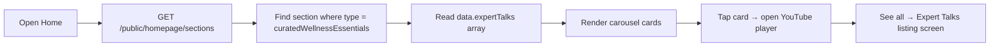

# Flutter Mobile API Guide: Expert Talks & Podcasts

This document describes the **public APIs** needed to build Expert Talks and Podcasts screens in the Cureka Flutter app.

> **Important:** Podcasts are **not a separate API resource**. They are Expert Talk items with `contentType: "podcast"`. Expert Talk items use `contentType: "talk"`. Both are returned from the same endpoint.

---

## 1. Common setup

### Base URL

| Environment | Base URL |
|-------------|----------|
| Production | `https://cureka.techbv.in/api/v1` |
| Local dev | `http://localhost:3000/api/v1` |

All paths below are relative to this base (e.g. `/public/expert-talks` → `https://cureka.techbv.in/api/v1/public/expert-talks`).

### Response envelope

Every API returns this shape:

```json
{
  "success": true,
  "data": { },
  "message": "Human-readable message",
  "timestamp": "2026-07-13T10:00:00.000Z"
}
```

Read your payload from `response.data`.

### Auth

| Endpoint | Auth |
|----------|------|
| `GET /public/expert-talks` | **None** |
| `GET /public/homepage/sections` | **None** |

No login, session cookie, or Bearer token is required for these screens.

### Standard headers

```
Content-Type: application/json
Accept: application/json
```

---

## 2. Screen overview

| Screen | Primary API | Notes |
|--------|-------------|-------|
| **Homepage preview** (Expert Talks carousel) | `GET /public/homepage/sections` | Up to **3** items from `curatedWellnessEssentials` section |
| **Expert Talks & Podcasts listing** | `GET /public/expert-talks` | Paginated list with optional filter |
| **Talks tab only** | `GET /public/expert-talks?contentType=talk` | Filter by type |
| **Podcasts tab only** | `GET /public/expert-talks?contentType=podcast` | Filter by type |
| **Video player** | No detail API | Play `videoUrl` from list item (YouTube embed) |

There is **no public GET-by-id endpoint** (e.g. no `/public/expert-talks/:refId`). Use the listing response or homepage section data directly.

---

## 3. Expert Talks & Podcasts listing

### API

| Method | Path | Auth |
|--------|------|------|
| `GET` | `/public/expert-talks` | None |

### Query params

| Param | Type | Default | Description |
|-------|------|---------|-------------|
| `page` | int | `1` | Min 1 |
| `limit` | int | `20` | Min 1, max 100 |
| `search` | string | — | Max 100 chars; searches `title` and `description` |
| `sortBy` | string | — | `createdAt`, `title`, `sortOrder`, `status`, `contentType` |
| `sortOrder` | string | `ASC`* | `ASC` or `DESC` |
| `contentType` | string | — | `talk` or `podcast` |

\* Default sort column is `sortOrder ASC`, then `createdAt DESC`.

### Business rules (backend enforced)

- Only **active** items are returned.
- Only items with a **non-empty YouTube `videoUrl`** are returned.
- `videoUrl` must be a YouTube URL (`youtube.com` or `youtu.be`).

### Response shape

```json
{
  "success": true,
  "data": {
    "data": [
      {
        "refId": "MAN20260001",
        "title": "Managing Diabetes Naturally",
        "description": "Expert advice on lifestyle changes",
        "videoUrl": "https://www.youtube.com/watch?v=dQw4w9WgXcQ",
        "thumbnail": {
          "key": "images/thumb.jpg",
          "name": "thumb.jpg",
          "url": "https://cdn.example.com/images/thumb.jpg?signed=..."
        },
        "contentType": "talk",
        "sortOrder": 1
      },
      {
        "refId": "POD20260002",
        "title": "Wellness Podcast Ep. 1",
        "description": "Weekly health tips",
        "videoUrl": "https://www.youtube.com/watch?v=abc123",
        "thumbnail": {
          "key": "images/pod.jpg",
          "name": "pod.jpg",
          "url": "https://cdn.example.com/images/pod.jpg?signed=..."
        },
        "contentType": "podcast",
        "sortOrder": 2
      }
    ],
    "total": 42,
    "page": 1,
    "limit": 12,
    "totalPages": 4,
    "hasNextPage": true,
    "hasPreviousPage": false
  },
  "message": "Expert talks retrieved successfully",
  "timestamp": "2026-07-13T10:00:00.000Z"
}
```

### Item fields

| Field | Type | Description |
|-------|------|-------------|
| `refId` | string | Public identifier (11-char code). Use as list item `id`. |
| `title` | string | Display title |
| `description` | string \| null | Short description |
| `videoUrl` | string | YouTube watch URL — use for video player |
| `thumbnail` | object \| null | `{ key, name, url }` — signed CDN URL in `url` |
| `contentType` | `"talk"` \| `"podcast"` | Distinguishes Expert Talk vs Podcast |
| `sortOrder` | number | Display order (lower = first) |

### Example requests

```bash
# All talks + podcasts (first page, web uses limit=12)
GET /public/expert-talks?page=1&limit=12

# Expert talks only
GET /public/expert-talks?page=1&limit=12&contentType=talk

# Podcasts only
GET /public/expert-talks?page=1&limit=12&contentType=podcast

# Search
GET /public/expert-talks?page=1&limit=12&search=diabetes

# Load more (page 2)
GET /public/expert-talks?page=2&limit=12
```

### Pagination (Load more)

Match the web app behavior:

1. First load: `page=1`, `limit=12`
2. On "Load more": increment `page`, append new items to the list
3. Stop when `hasNextPage === false`

---

## 4. Homepage preview (Expert Talks section)

The homepage shows a **preview carousel** of up to 3 expert talks/podcasts (mixed — no `contentType` filter).

### API

| Method | Path | Auth |
|--------|------|------|
| `GET` | `/public/homepage/sections` | None |

> There is **no dedicated query flag** (like `watchAndShop=true`) for this section. Fetch all sections and filter client-side.

### Screen flow



### Response shape (relevant section only)

```json
{
  "success": true,
  "data": {
    "sections": [
      {
        "index": 6,
        "type": "curatedWellnessEssentials",
        "title": "Curated Wellness Essentials",
        "slug": "curated-wellness-essentials",
        "data": {
          "expertTalks": [
            {
              "refId": "MAN20260001",
              "title": "Managing Diabetes Naturally",
              "description": "Expert advice on lifestyle changes",
              "videoUrl": "https://www.youtube.com/watch?v=dQw4w9WgXcQ",
              "thumbnail": {
                "key": "images/thumb.jpg",
                "name": "thumb.jpg",
                "url": "https://cdn.example.com/images/thumb.jpg?signed=..."
              },
              "contentType": "talk",
              "sortOrder": 1
            }
          ]
        }
      }
    ]
  },
  "message": "Homepage sections retrieved successfully",
  "timestamp": "2026-07-13T10:00:00.000Z"
}
```

### Flutter parsing

```dart
final sections = response.data['sections'] as List;
final expertSection = sections.cast<Map<String, dynamic>>().firstWhere(
  (s) => s['type'] == 'curatedWellnessEssentials',
  orElse: () => {},
);
final expertTalks = (expertSection['data']?['expertTalks'] as List?) ?? [];
```

Sort by `sortOrder ASC` before rendering (web does this).

---

## 5. Video playback (YouTube)

All items use **YouTube URLs only**. There is no direct MP4 file for expert talks (unlike Watch & Shop).

### Supported URL formats

- `https://www.youtube.com/watch?v=VIDEO_ID`
- `https://youtu.be/VIDEO_ID`
- `https://www.youtube.com/embed/VIDEO_ID`
- `https://www.youtube.com/shorts/VIDEO_ID`

### Extract video ID (Dart example)

```dart
String? extractYouTubeVideoId(String url) {
  final patterns = [
    RegExp(r'(?:youtube\.com/watch\?v=)([^&\n?#]+)', caseSensitive: false),
    RegExp(r'(?:youtu\.be/)([^&\n?#]+)', caseSensitive: false),
    RegExp(r'(?:youtube\.com/embed/)([^&\n?#]+)', caseSensitive: false),
    RegExp(r'(?:youtube\.com/shorts/)([^&\n?#]+)', caseSensitive: false),
  ];
  for (final pattern in patterns) {
    final match = pattern.firstMatch(url.trim());
    if (match != null) return match.group(1);
  }
  return null;
}
```

### Embed URL (match web)

Web uses `youtube-nocookie.com` with these params:

```
https://www.youtube-nocookie.com/embed/{videoId}?autoplay=1&controls=1&playsinline=1&rel=0&modestbranding=1&fs=1
```

**Flutter options:**

| Approach | Package / method |
|----------|------------------|
| In-app WebView | Load embed URL above |
| Native player | `youtube_player_iframe` or `youtube_player_flutter` with `videoId` |
| External app | `url_launcher` with `videoUrl` |

---

## 6. Thumbnail image

Resolve thumbnail in this priority (match web):

1. `thumbnail.url` when `thumbnail` is an object with a signed URL
2. YouTube fallback: `https://img.youtube.com/vi/{videoId}/hqdefault.jpg`
3. App fallback placeholder image

```dart
String resolveThumbnailUrl(Map<String, dynamic> item) {
  final thumbnail = item['thumbnail'];
  if (thumbnail is Map && thumbnail['url'] != null) {
    return thumbnail['url'] as String;
  }
  final videoId = extractYouTubeVideoId(item['videoUrl'] ?? '');
  if (videoId != null) {
    return 'https://img.youtube.com/vi/$videoId/hqdefault.jpg';
  }
  return 'assets/images/expert-talk-fallback.png'; // your placeholder
}
```

---

## 7. Flutter data models (suggested)

```dart
enum ExpertTalkContentType { talk, podcast }

class ExpertTalkItem {
  final String refId;
  final String title;
  final String? description;
  final String videoUrl;
  final String? thumbnailUrl;
  final ExpertTalkContentType contentType;
  final int sortOrder;

  ExpertTalkItem({
    required this.refId,
    required this.title,
    this.description,
    required this.videoUrl,
    this.thumbnailUrl,
    required this.contentType,
    required this.sortOrder,
  });

  factory ExpertTalkItem.fromJson(Map<String, dynamic> json) {
    final rawType = json['contentType'] as String? ?? 'talk';
    return ExpertTalkItem(
      refId: json['refId'] as String,
      title: json['title'] as String,
      description: json['description'] as String?,
      videoUrl: json['videoUrl'] as String,
      thumbnailUrl: _readThumbnailUrl(json['thumbnail']),
      contentType: rawType == 'podcast'
          ? ExpertTalkContentType.podcast
          : ExpertTalkContentType.talk,
      sortOrder: (json['sortOrder'] as num?)?.toInt() ?? 0,
    );
  }

  static String? _readThumbnailUrl(dynamic thumbnail) {
    if (thumbnail is Map && thumbnail['url'] is String) {
      return thumbnail['url'] as String;
    }
    return null;
  }
}

class PaginatedExpertTalks {
  final List<ExpertTalkItem> items;
  final int total;
  final int page;
  final int limit;
  final int totalPages;
  final bool hasNextPage;
  final bool hasPreviousPage;

  PaginatedExpertTalks({
    required this.items,
    required this.total,
    required this.page,
    required this.limit,
    required this.totalPages,
    required this.hasNextPage,
    required this.hasPreviousPage,
  });

  factory PaginatedExpertTalks.fromApiEnvelope(Map<String, dynamic> envelope) {
    final data = envelope['data'] as Map<String, dynamic>;
    final list = (data['data'] as List)
        .map((e) => ExpertTalkItem.fromJson(e as Map<String, dynamic>))
        .toList();
    return PaginatedExpertTalks(
      items: list,
      total: data['total'] as int,
      page: data['page'] as int,
      limit: data['limit'] as int,
      totalPages: data['totalPages'] as int,
      hasNextPage: data['hasNextPage'] as bool,
      hasPreviousPage: data['hasPreviousPage'] as bool,
    );
  }
}
```

---

## 8. API service example (Dio)

```dart
class ExpertTalksApi {
  ExpertTalksApi(this._dio);
  final Dio _dio;

  Future<PaginatedExpertTalks> fetchExpertTalks({
    int page = 1,
    int limit = 12,
    String? search,
    ExpertTalkContentType? contentType,
  }) async {
    final response = await _dio.get(
      '/public/expert-talks',
      queryParameters: {
        'page': page,
        'limit': limit,
        if (search != null && search.isNotEmpty) 'search': search,
        if (contentType != null) 'contentType': contentType.name,
      },
    );
    return PaginatedExpertTalks.fromApiEnvelope(
      response.data as Map<String, dynamic>,
    );
  }

  Future<List<ExpertTalkItem>> fetchHomepagePreview() async {
    final response = await _dio.get('/public/homepage/sections');
    final sections = (response.data['data']['sections'] as List)
        .cast<Map<String, dynamic>>();
    final section = sections.firstWhere(
      (s) => s['type'] == 'curatedWellnessEssentials',
      orElse: () => {},
    );
    final raw = (section['data']?['expertTalks'] as List?) ?? [];
    final items = raw
        .map((e) => ExpertTalkItem.fromJson(e as Map<String, dynamic>))
        .toList()
      ..sort((a, b) => a.sortOrder.compareTo(b.sortOrder));
    return items;
  }
}
```

---

## 9. UI recommendations

### Listing screen

- **Title:** "Expert Talks & Podcasts"
- **Optional tabs:** All | Talks | Podcasts (pass `contentType` query param)
- **Card content:** thumbnail, title, description (2–3 lines), play button overlay
- **Tap card:** open in-app YouTube player modal
- **Pagination:** "Load more" button using `hasNextPage`

### Homepage section

- Horizontal scroll carousel (max 3 items from API)
- "See all" navigates to full listing screen
- Same card + player behavior as listing

### Empty / error states

| State | Message |
|-------|---------|
| Empty list | "No expert talks available right now." |
| API error | "Unable to load expert talks. Please try again." |

---

## 10. Error handling

| HTTP code | Meaning | Action |
|-----------|---------|--------|
| `400` | Invalid query params | Show error message from `message` |
| `404` | Not found | Show empty state |
| `5xx` | Server error | Retry / show generic error |

Error response example:

```json
{
  "success": false,
  "data": null,
  "message": "Validation failed",
  "timestamp": "2026-07-13T10:00:00.000Z"
}
```

---

## 11. Quick reference

| Task | API |
|------|-----|
| Full listing (all types) | `GET /public/expert-talks?page=1&limit=12` |
| Expert talks only | `GET /public/expert-talks?contentType=talk&page=1&limit=12` |
| Podcasts only | `GET /public/expert-talks?contentType=podcast&page=1&limit=12` |
| Homepage preview | `GET /public/homepage/sections` → filter `type === "curatedWellnessEssentials"` |
| Play video | Use `videoUrl` → extract YouTube ID → embed player |
| Thumbnail | `thumbnail.url` or YouTube `hqdefault.jpg` fallback |

---

## 12. cURL test commands

```bash
# All expert talks & podcasts
curl "https://cureka.techbv.in/api/v1/public/expert-talks?page=1&limit=12"

# Podcasts only
curl "https://cureka.techbv.in/api/v1/public/expert-talks?page=1&limit=12&contentType=podcast"

# Expert talks only
curl "https://cureka.techbv.in/api/v1/public/expert-talks?page=1&limit=12&contentType=talk"

# Homepage sections (includes curatedWellnessEssentials)
curl "https://cureka.techbv.in/api/v1/public/homepage/sections"
```

---

## 13. Swagger / live API docs

When the backend is running locally:

```
http://localhost:3000/api/v1/docs
```

Look for tag: **Public Expert Talks**

---

## 14. Admin CMS (not for Flutter app)

Admin endpoints exist at `/master/expert-talks` for the CMS panel only. They require **JWT Bearer** auth with `admin` or `super_admin` role. The Flutter mobile app should **not** call these.

| Method | Path | Purpose |
|--------|------|---------|
| `POST` | `/master/expert-talks` | Create talk/podcast |
| `GET` | `/master/expert-talks` | Admin list |
| `PATCH` | `/master/expert-talks/:refId` | Update |
| `DELETE` | `/master/expert-talks/:refId` | Delete (super_admin only) |

---

## 15. Related docs

- Watch & Shop, Blog, Support APIs: `docs/flutter-mobile-watch-shop-blog-support-api.md`
- Web frontend reference: `Cureka-frontend/src/modules/expert-talks/`

---

**Last updated:** July 2026  
**Backend module:** `cureka-backend/modules/master` + `cureka-backend/modules/public`
