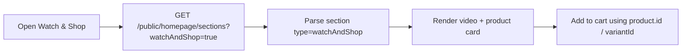
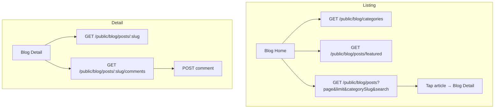
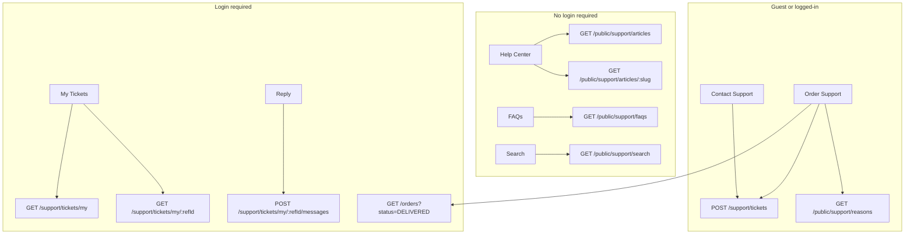

# Flutter Mobile API Guide: Watch & Shop, Blog, Comments & Support

This document describes the **public and user-facing APIs** needed to build the following mobile screens:

1. **Watch & Shop** (video product carousel)
2. **Blog listing** and **Blog detail**
3. **Blog comments** (read + submit)
4. **Support** (Help Center, FAQs, Order Support, Contact, My Tickets)

---

## 1. Common setup

### Base URL

| Environment | Base URL |
|-------------|----------|
| Production | `https://cureka.techbv.in/api/v1` |
| Local dev | `http://localhost:3000/api/v1` |

All paths below are relative to this base (e.g. `/public/blog/posts` → `https://cureka.techbv.in/api/v1/public/blog/posts`).

### Response envelope

Every API returns this shape:

```json
{
  "success": true,
  "data": { },
  "message": "Human-readable message",
  "timestamp": "2026-07-09T10:00:00.000Z"
}
```

Read your payload from `response.data`.

### Auth (important for Flutter)

The backend uses an **opaque session token** stored in an HttpOnly cookie named `user_session` — **not JWT / Bearer**.

| Auth level | Guard | When needed |
|------------|-------|-------------|
| **None** | — | Blog listing, blog detail, public support articles/FAQs |
| **Optional session** | `OptionalSessionCookieGuard` | Blog comment submit, create support ticket, order-support reasons |
| **Required + verified user** | `SessionCookieGuard` + `VerifiedUserGuard` | My tickets, ticket chat, notifications, delivered orders list |

#### Flutter session handling

1. **Enable cookies** on your HTTP client (e.g. `CookieManager` with Dio, or persist `Set-Cookie` manually).
2. After login, send the session on every request:
   ```
   Cookie: user_session=<opaque_token>
   ```
3. **Login flow:**
   - `POST /auth/send-otp` → `{ "mobileNumber": "9876543210" }`
   - `POST /auth/verify-otp` → `{ "mobileNumber": "9876543210", "otp": "123456" }`
   - Response includes `data.token` for registered users — store it and send as `user_session` cookie value.
4. **Guest session** (for cart / optional endpoints):
   - `POST /auth/guest-login` → sets `user_session` cookie (no token in body; read from `Set-Cookie` header).
5. **Refresh expired session:**
   - `POST /auth/refresh` with body `{ "refreshToken": "<stored_session_token>" }` if cookie is not auto-managed.

### Standard headers

```
Content-Type: application/json
Accept: application/json
Cookie: user_session=<token>   // when logged in or guest
```

### Pagination query params (shared)

| Param | Type | Default | Notes |
|-------|------|---------|-------|
| `page` | int | `1` | Min 1 |
| `limit` | int | `20` | Min 1, max 100 |
| `search` | string | — | Max 100 chars |
| `sortBy` | string | — | Field name |
| `sortOrder` | string | — | `ASC` or `DESC` |

Paginated list responses include:

```json
{
  "data": [],
  "total": 42,
  "page": 1,
  "limit": 20,
  "totalPages": 3,
  "hasNextPage": true,
  "hasPreviousPage": false
}
```

---

## 2. Watch & Shop

Short-form videos linked to products (homepage “Watch & Shop” section).

### Screen flow



### API

| Method | Path | Auth |
|--------|------|------|
| `GET` | `/public/homepage/sections?watchAndShop=true` | None |

**Alternative:** `GET /public/homepage/sections` (no query) returns **all** active homepage sections; filter client-side where `type === "watchAndShop"`.

### Query params (`HomepageSectionsQueryDto`)

| Param | Type | Description |
|-------|------|-------------|
| `watchAndShop` | boolean | `true` to fetch only Watch & Shop section |

Other section flags: `heroBanner`, `shopByCategory`, `bestSellers`, `healthReads`, etc.

### Response shape

```json
{
  "success": true,
  "data": {
    "sections": [
      {
        "index": 5,
        "type": "watchAndShop",
        "title": "Watch & Shop",
        "slug": "watch-and-shop",
        "data": {
          "items": [
            {
              "refId": "abc123",
              "title": "Multivitamin review",
              "videoUrl": "https://www.youtube.com/watch?v=xxxxx",
              "mediaUrl": {
                "key": "uploads/...",
                "name": "video.mp4",
                "url": "https://cdn.example.com/uploads/.../video.mp4"
              },
              "sortOrder": 1,
              "product": {
                "refId": "prod-ref-id",
                "id": "uuid-for-cart-apis",
                "name": "Whole Food Multivitamin",
                "slug": "whole-food-multivitamin",
                "productType": "SIMPLE",
                "defaultVariantId": "variant-uuid",
                "variantId": "variant-uuid",
                "primaryImageUrl": {
                  "key": "...",
                  "name": "image.jpg",
                  "url": "https://cdn.example.com/..."
                },
                "pricing": {
                  "minSellingPrice": 499,
                  "maxSellingPrice": 499,
                  "minMrp": 699,
                  "maxDiscountPercentage": 29,
                  "inStock": true
                },
                "subscriptionEnabled": false,
                "codAvailable": true
              }
            }
          ]
        }
      }
    ]
  }
}
```

### Flutter notes

| Field | Usage |
|-------|-------|
| `videoUrl` | External embed (YouTube). Parse watch URL for video ID. |
| `mediaUrl` | Direct MP4 when hosted on storage (`mediaUrl.url`). |
| `product.id` | Use for `POST /cart/items` (`productId`). |
| `product.variantId` | Use for `POST /cart/items` (`variantId`). |
| `product.pricing.minSellingPrice` | Display price |
| `product.pricing.minMrp` | Display MRP / strike-through |

**Video priority (match web):** prefer `mediaUrl.url` (direct file) when present; else use `videoUrl` (YouTube).

---

## 3. Blog

### 3.1 Screen flows



### 3.2 API reference

| # | Method | Path | Auth | Purpose |
|---|--------|------|------|---------|
| 1 | `GET` | `/public/blog/categories` | None | Category chips / filters |
| 2 | `GET` | `/public/blog/posts/featured` | None | Featured carousel |
| 3 | `GET` | `/public/blog/posts/trending` | None | Trending posts |
| 4 | `GET` | `/public/blog/posts` | None | Paginated listing |
| 5 | `GET` | `/public/blog/posts/:slug` | None | Full article + products + related |
| 6 | `GET` | `/public/blog/posts/:slug/comments` | None | Approved comments only |
| 7 | `POST` | `/public/blog/posts/:slug/comments` | Optional session | Submit comment (moderated) |

### 3.3 Blog listing — `GET /public/blog/posts`

**Query params:**

| Param | Type | Notes |
|-------|------|-------|
| `page` | int | Default `1` |
| `limit` | int | Web uses `9` per page |
| `categorySlug` | string | Filter by category slug |
| `search` | string | Title/content search |
| `tag` | string | Filter by tag |

**Example:**

```
GET /public/blog/posts?page=1&limit=9&categorySlug=nutrition
```

**Card item (`data.data[]`):**

```json
{
  "refId": "post-ref-id",
  "title": "5 Tips for Better Sleep",
  "slug": "5-tips-for-better-sleep",
  "excerpt": "Short summary...",
  "categoryRefId": "cat-ref-id",
  "author": "Dr. Smith",
  "featuredImage": {
    "key": "...",
    "name": "cover.jpg",
    "url": "https://cdn.example.com/..."
  },
  "tags": ["sleep", "wellness"],
  "publishedAt": "2026-06-01T08:00:00.000Z",
  "views": 120
}
```

### 3.4 Blog categories — `GET /public/blog/categories`

```json
[
  {
    "refId": "cat-ref-id",
    "name": "Nutrition",
    "slug": "nutrition",
    "description": "...",
    "sortOrder": 1
  }
]
```

### 3.5 Blog detail — `GET /public/blog/posts/:slug`

**Example:** `GET /public/blog/posts/5-tips-for-better-sleep`

Increments view count server-side.

```json
{
  "refId": "post-ref-id",
  "title": "5 Tips for Better Sleep",
  "slug": "5-tips-for-better-sleep",
  "excerpt": "...",
  "content": "<p>HTML content...</p>",
  "categoryRefId": "cat-ref-id",
  "author": "Dr. Smith",
  "featuredImage": { "key": "...", "name": "...", "url": "..." },
  "featuredVideo": null,
  "tags": ["sleep"],
  "metaTitle": "...",
  "metaDescription": "...",
  "publishedAt": "2026-06-01T08:00:00.000Z",
  "views": 121,
  "products": [
    {
      "refId": "prod-ref",
      "name": "Melatonin 3mg",
      "slug": "melatonin-3mg",
      "imageSrc": "https://...",
      "price": 299,
      "mrp": 399
    }
  ],
  "relatedBlogs": [
    {
      "refId": "...",
      "title": "...",
      "slug": "...",
      "excerpt": "...",
      "featuredImage": { "url": "..." }
    }
  ]
}
```

Render `content` as HTML (use `flutter_html` or WebView).

### 3.6 Blog comments

#### List — `GET /public/blog/posts/:slug/comments`

Returns **approved** comments only.

```json
[
  {
    "refId": "comment-ref-id",
    "guestName": "Rahul",
    "content": "Very helpful article!",
    "createdAt": "2026-06-02T10:30:00.000Z"
  }
]
```

> Logged-in users may have `guestName: null`; display a generic label like “User” or fetch name from profile if needed.

#### Submit — `POST /public/blog/posts/:slug/comments`

**Auth:** Optional session (cookie). Logged-in user → name/email taken from profile. Guest → send `guestName` + `guestEmail`.

**Body:**

```json
{
  "content": "Great tips, thank you!",
  "guestName": "Rahul",
  "guestEmail": "rahul@example.com"
}
```

| Field | Required | Notes |
|-------|----------|-------|
| `content` | Yes | Comment text |
| `guestName` | Guest only | Max 150 chars |
| `guestEmail` | Guest only | Max 255 chars |

**Behaviour:** Comment is saved with status `pending`. Show success message: *“Your comment was submitted and will appear after review.”* Do **not** append to list immediately.

---

## 4. Support (full flow)

The support module has **4 tabs** on web:

| Tab | Purpose |
|-----|---------|
| Help Center | Searchable help articles |
| FAQs | Frequently asked questions |
| Order Support | Return / Refund / Replacement for delivered orders |
| Contact Support | General ticket form |

Plus **My Tickets** (logged-in users) for ticket history and chat.

### 4.1 Screen flow overview



### 4.2 Public support APIs (no auth)

| Method | Path | Purpose |
|--------|------|---------|
| `GET` | `/public/support/categories` | Categories for articles/FAQs |
| `GET` | `/public/support/articles` | Paginated help articles |
| `GET` | `/public/support/articles/:slug` | Single article (HTML content) |
| `GET` | `/public/support/faqs` | Paginated FAQs |
| `GET` | `/public/support/search` | Combined article + FAQ search |
| `GET` | `/public/support/reasons` | Order-support reason list |

#### Categories — `GET /public/support/categories`

**Query:** `type` = `article` | `faq` | `both` (optional)

```json
[
  {
    "refId": "cat-ref",
    "name": "Orders & Delivery",
    "slug": "orders-delivery",
    "type": "article"
  }
]
```

#### Help articles — `GET /public/support/articles`

| Query | Type | Notes |
|-------|------|-------|
| `search` | string | Search title/content |
| `categoryRefId` | string | Filter by category |
| `page`, `limit` | int | Pagination |

```json
{
  "data": [
    {
      "refId": "art-ref",
      "title": "How to track my order",
      "slug": "how-to-track-order",
      "categoryRefId": "cat-ref",
      "featuredImage": { "url": "..." },
      "views": 50,
      "createdAt": "2026-01-15T00:00:00.000Z"
    }
  ],
  "total": 10,
  "page": 1,
  "limit": 20,
  "totalPages": 1
}
```

#### Article detail — `GET /public/support/articles/:slug`

Includes full `content` (HTML).

#### FAQs — `GET /public/support/faqs`

Same pagination params as articles.

```json
{
  "data": [
    {
      "refId": "faq-ref",
      "question": "What is your return policy?",
      "answer": "You can return within 7 days...",
      "categoryRefId": "cat-ref"
    }
  ],
  "total": 25,
  "page": 1,
  "limit": 20,
  "totalPages": 2
}
```

#### Combined search — `GET /public/support/search`

| Query | Type |
|-------|------|
| `search` | string |
| `categoryRefId` | string |
| `page`, `limit` | int |

```json
{
  "articles": [ /* article cards */ ],
  "faqs": [ /* faq items */ ]
}
```

#### Order support reasons — `GET /public/support/reasons`

**Auth:** Optional session (needed when validating `orderId` against user).

| Query | Type | Required | Values |
|-------|------|----------|--------|
| `workflow` | string | Yes | `return`, `refund`, `replacement` |
| `orderId` | string | No | Order ref ID — filters valid reasons |

```json
[
  {
    "refId": "reason-ref-id",
    "title": "Product damaged",
    "code": "DAMAGED",
    "description": "Item received in damaged condition",
    "pickupMode": "pickup_required",
    "isMandatory": true,
    "commentsRequired": true,
    "imagesRequired": true,
    "videoRequired": false,
    "sortOrder": 1
  }
]
```

| `pickupMode` | UI hint |
|--------------|---------|
| `pickup_required` | “Pickup will be arranged” |
| `no_pickup_required` | “No pickup required” |

---

### 4.3 Create support ticket — `POST /support/tickets`

**Auth:** Optional session. Guests must send contact fields.

#### JSON body (no attachment)

```json
{
  "category": "order_issue",
  "subject": "Wrong item delivered",
  "description": "I received a different product than ordered.",
  "orderId": "optional-order-ref-id",
  "guestName": "Rahul Kumar",
  "guestEmail": "rahul@example.com",
  "guestMobile": "9876543210"
}
```

#### Order support body (Return / Refund / Replacement)

Use `workflow` + `reasonRefId` instead of `category`:

```json
{
  "workflow": "return",
  "reasonRefId": "reason-ref-id",
  "subject": "Return: Product damaged",
  "description": "Box was torn and tablets were broken.",
  "orderId": "order-ref-id",
  "guestName": "Rahul Kumar",
  "guestEmail": "rahul@example.com",
  "guestMobile": "9876543210"
}
```

#### Contact support categories (`category` field)

| Value | Label |
|-------|-------|
| `order_issue` | Order Issue |
| `refund` | Refund |
| `product` | Product |
| `delivery` | Delivery |
| `consultation` | Consultation |
| `others` | Others |

#### Order support workflows (`workflow` field)

| Value | Label |
|-------|-------|
| `return` | Return |
| `refund` | Refund |
| `replacement` | Replacement |

#### Validation rules (match web)

| Rule | Detail |
|------|--------|
| `subject` | Required, max 255 |
| `description` | Required, min 10 chars for contact form |
| Guest fields | `guestName`, `guestEmail`, `guestMobile` required when not logged in |
| Order support | `workflow`, `orderId`, `reasonRefId` required |
| Reason `commentsRequired` | `description` min 10 chars |
| Reason `imagesRequired` | Attachment required |

#### Multipart (with attachment)

```
Content-Type: multipart/form-data

data: {"workflow":"return","reasonRefId":"...","subject":"...","description":"...","orderId":"..."}
attachmentFile: <binary file>
```

Field name for file: **`attachmentFile`**. JSON payload goes in form field **`data`** as a string.

#### Success response

```json
{
  "refId": "ticket-ref-id",
  "ticketNumber": "TKT-2026-001234",
  "category": "order_issue",
  "subject": "Wrong item delivered",
  "status": "open",
  "priority": "medium",
  "orderId": "order-ref-id",
  "workflow": "return",
  "createdAt": "2026-07-09T10:00:00.000Z"
}
```

---

### 4.4 My Tickets (login required)

| Method | Path | Purpose |
|--------|------|---------|
| `GET` | `/support/tickets/my` | List user's tickets |
| `GET` | `/support/tickets/my/:refId` | Ticket detail + message thread |
| `POST` | `/support/tickets/my/:refId/messages` | Reply to ticket |
| `GET` | `/support/tickets/notifications` | In-app notifications |
| `GET` | `/support/tickets/notifications/unread-count` | Badge count |
| `PATCH` | `/support/tickets/notifications/read` | Mark read |

#### List tickets — `GET /support/tickets/my`

```
GET /support/tickets/my?page=1&limit=50
```

#### Ticket detail — `GET /support/tickets/my/:refId`

```json
{
  "ticket": {
    "refId": "ticket-ref",
    "ticketNumber": "TKT-2026-001234",
    "category": "order_issue",
    "subject": "...",
    "status": "open",
    "priority": "medium",
    "description": "Original message",
    "orderId": "...",
    "workflow": "return",
    "createdAt": "..."
  },
  "messages": [
    {
      "refId": "msg-ref",
      "senderType": "user",
      "message": "Please help with my return",
      "attachmentUrl": null,
      "createdAt": "..."
    },
    {
      "refId": "msg-ref-2",
      "senderType": "agent",
      "message": "We have initiated pickup",
      "attachmentUrl": { "url": "..." },
      "createdAt": "..."
    }
  ]
}
```

#### Ticket statuses

| Status | Meaning |
|--------|---------|
| `open` | New ticket |
| `in_progress` | Being handled |
| `resolved` | Resolved |
| `closed` | Closed — disable reply UI |

#### Reply — `POST /support/tickets/my/:refId/messages`

**JSON:**

```json
{ "message": "Here is additional information" }
```

**Multipart (with attachment):** same pattern as create ticket (`data` + `attachmentFile`).

---

### 4.5 Orders API (for Order Support tab)

Fetch delivered orders so user can pick one:

```
GET /orders?status=DELIVERED&limit=50
```

**Auth:** Required (verified user).

Use `order.refId` as `orderId` when calling `/public/support/reasons` and `POST /support/tickets`.

---

## 5. Recommended Flutter screen → API mapping

| Screen | APIs to call (in order) |
|--------|-------------------------|
| **Watch & Shop** | `GET /public/homepage/sections?watchAndShop=true` |
| **Blog home** | `GET /public/blog/categories` + `GET /public/blog/posts/featured` + `GET /public/blog/posts?page=1&limit=9` |
| **Blog filtered** | `GET /public/blog/posts?categorySlug={slug}&page={n}` |
| **Blog detail** | `GET /public/blog/posts/{slug}` + `GET /public/blog/posts/{slug}/comments` |
| **Post comment** | `POST /public/blog/posts/{slug}/comments` |
| **Support home** | Prefetch: `GET /public/support/articles` + `GET /public/support/faqs` |
| **Help article** | `GET /public/support/articles/{slug}` |
| **Support search** | `GET /public/support/search?search={q}` |
| **Contact ticket** | `POST /support/tickets` |
| **Order support** | `GET /orders?status=DELIVERED` → `GET /public/support/reasons?workflow={type}&orderId={id}` → `POST /support/tickets` |
| **My tickets** | `GET /support/tickets/my` |
| **Ticket chat** | `GET /support/tickets/my/{refId}` → `POST /support/tickets/my/{refId}/messages` |

---

## 6. Error handling

| HTTP code | Meaning | Action |
|-----------|---------|--------|
| `400` | Validation error | Show `message` from response |
| `401` | Session missing/expired | Call `POST /auth/refresh` or re-login |
| `403` | User not verified | Prompt registration / OTP verify |
| `404` | Not found | Show empty state |
| `429` | Rate limit (OTP) | Show “try again later” |

---

## 7. Quick test commands (cURL)

```bash
# Watch & Shop
curl "https://cureka.techbv.in/api/v1/public/homepage/sections?watchAndShop=true"

# Blog listing
curl "https://cureka.techbv.in/api/v1/public/blog/posts?page=1&limit=9"

# Blog detail
curl "https://cureka.techbv.in/api/v1/public/blog/posts/your-slug-here"

# Support FAQs
curl "https://cureka.techbv.in/api/v1/public/support/faqs?page=1&limit=20"

# Guest support ticket
curl -X POST "https://cureka.techbv.in/api/v1/support/tickets" \
  -H "Content-Type: application/json" \
  -d '{"category":"others","subject":"Test ticket","description":"This is a test message from mobile.","guestName":"Test User","guestEmail":"test@example.com","guestMobile":"9876543210"}'
```

---

## 8. Related docs

- Cart & checkout: `docs/frontend-cart-checkout-integration.md`
- Auth uses cookie session — see `modules/auth/controllers/auth.controller.ts`
- Web reference implementations:
  - Blog: `Cureka-frontend/src/modules/blog/api.ts`
  - Support: `Cureka-frontend/src/modules/support/api.ts`
  - Watch & Shop: `Cureka-frontend/src/modules/home/api/homepageSections.api.ts`

---

*Last updated: July 2026 — aligned with Cureka backend `api/v1` routes.*
