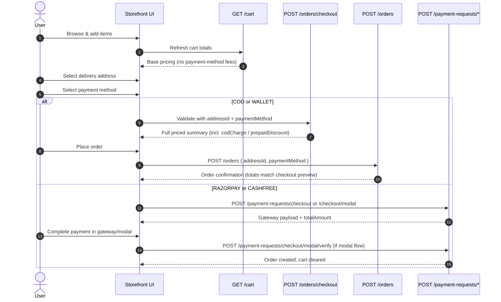

# Frontend Integration Guide: Cart & Checkout Flow

This document explains how the storefront should integrate with the cart, checkout validation, order placement, and online payment APIs. It focuses on **pricing/charges** (including COD charge) so the checkout UI can display totals that match what the backend will persist on order creation.

---

## 1. High-level checkout flow



**Base URL:** `/api/v1`

**Auth:** Session cookie (`SessionCookieGuard`). Cart endpoints work for guest/session users. Order placement and payment endpoints also require a **verified user** (`VerifiedUserGuard`).

---

## 2. API reference

### 2.1 Cart

| Action | Method | Path | Body |
|--------|--------|------|------|
| Get cart | `GET` | `/cart` | — |
| Add item | `POST` | `/cart/items` | `{ productId, variantId, quantity }` |
| Update qty | `PATCH` | `/cart/items/:itemId` | `{ quantity }` |
| Remove item | `DELETE` | `/cart/items/:itemId` | — |
| Apply coupon | `POST` | `/cart/coupon` | `{ couponCode }` |
| Remove coupon | `DELETE` | `/cart/coupon` | — |
| Clear cart | `DELETE` | `/cart` | — |
| Merge guest cart | `POST` | `/cart/merge` | `{ guestUserId }` (verified user only) |

### 2.2 Checkout validation

| Action | Method | Path | Body |
|--------|--------|------|------|
| Validate checkout | `POST` | `/orders/checkout` | `{ addressId, paymentMethod? }` |

Validates address, stock, coupon, and returns a priced summary. Pass **`paymentMethod`** to include COD charge or prepaid discount in the preview (see §5).

### 2.3 Place order (COD / WALLET only)

| Action | Method | Path | Body |
|--------|--------|------|------|
| Place order | `POST` | `/orders` | `{ addressId, paymentMethod, notes? }` |

**Allowed `paymentMethod` values:** `COD`, `WALLET`, `RAZORPAY`, `CASHFREE`

**Important:** If `paymentMethod` is `RAZORPAY` or `CASHFREE`, this endpoint returns `400`:

```json
{
  "statusCode": 400,
  "message": "Online RAZORPAY checkout must use POST /payment-requests/checkout"
}
```

Use the payment-requests flow instead (§2.4).

### 2.4 Online payment (RAZORPAY / CASHFREE)

| Action | Method | Path | Body |
|--------|--------|------|------|
| Payment link checkout | `POST` | `/payment-requests/checkout` | `{ addressId }` |
| Modal checkout (Razorpay order / Cashfree session) | `POST` | `/payment-requests/checkout/modal` | `{ addressId }` |
| Verify modal payment | `POST` | `/payment-requests/checkout/modal/verify` | Razorpay or Cashfree fields (see below) |
| Cancel modal checkout | `POST` | `/payment-requests/checkout/modal/cancel` | `{ razorpay_order_id? }` |

**Verify body (send one gateway’s fields):**

Razorpay:

```json
{
  "razorpay_order_id": "...",
  "razorpay_payment_id": "...",
  "razorpay_signature": "..."
}
```

Cashfree:

```json
{
  "cf_order_id": "...",
  "cf_payment_id": "..."
}
```

---

## 3. Pricing response shape

Cart and checkout responses share the same pricing fields (numbers, not strings):

```typescript
type CartPricing = {
  subtotal: number;           // Sum of line items (unitPrice × quantity)
  coupon: { id: string; code: string; title: string } | null;
  discountAmount: number;     // Coupon discount
  shippingAmount: number;
  handlingAmount: number;
  platformFee: number;
  codCharge: number;          // Added only for COD
  prepaidDiscount: number;    // Subtracted only for non-COD prepaid methods
  grandTotal: number;
};

type CartResponse = {
  cartId: string;
  items: CartLineItem[];
  totalItems: number;
} & CartPricing;
```

**Grand total formula (backend source of truth):**

```
payableBeforeShipping = subtotal - discountAmount

grandTotal =
  subtotal
  - discountAmount
  + shippingAmount
  + handlingAmount
  + platformFee
  + codCharge
  - prepaidDiscount
```

`grandTotal` is floored at `0`.

---

## 4. How each charge is calculated

All threshold-based rules (except platform fee) compare against:

**`payableBeforeShipping` = subtotal − discountAmount**

| Field | When applied | Threshold compares against | Default (if admin setting inactive) |
|-------|----------------|---------------------------|-------------------------------------|
| `shippingAmount` | Waived if payable ≥ free-shipping threshold, or coupon type is `free_shipping` | `shipping_charge_threshold` | ₹50 shipping, free at ₹900 |
| `handlingAmount` | Applied while payable **≤** `handling_charge_threshold` | payable | ₹50 while payable ≤ ₹900 |
| `platformFee` | Applied while **subtotal** **<** `platform_fee_threshold` | **subtotal** (not payable) | ₹50 while subtotal < ₹900 |
| `codCharge` | Only when `paymentMethod === 'COD'` **and** payable **≤** `cod_charge_threshold` | payable | ₹50 (charge disabled if threshold is 0) |
| `prepaidDiscount` | Only when `paymentMethod` is set and **not** `COD`, and payable **≤** `prepaid_charge_threshold` | payable | ₹0 (disabled if threshold is 0) |

### Threshold rule (critical)

For COD, handling, and prepaid:

- Charge/discount applies when **`payableBeforeShipping <= threshold`**
- Once payable **exceeds** the threshold, that charge is **waived**
- If **`threshold <= 0`**, the charge is **fully disabled** (always `0`)

So for COD to ever appear:

1. User must select **`paymentMethod: "COD"`** when pricing is calculated.
2. Admin setting **`cod_charge_threshold`** must be a **positive** number (e.g. `1500`).
3. Admin setting **`cod_charge`** must be active with a positive value (default ₹50).

If `cod_charge_threshold` is `0` in admin (current seed default), **`codCharge` will always be `0` even for COD** — this is backend configuration, not a UI bug.

---

## 5. Payment-method-specific charges on checkout

### Cart API does not use payment method

`GET /cart` (and all cart mutations) calculate pricing **without** `paymentMethod`. Therefore:

- `codCharge` is always **`0`**
- `prepaidDiscount` is always **`0`**

The cart page can show base fees (shipping, handling, platform fee) but **must not** rely on cart response for payment-method-specific lines.

### Checkout validation supports optional `paymentMethod`

`POST /orders/checkout` accepts:

```json
{
  "addressId": "550e8400-e29b-41d4-a716-446655440000",
  "paymentMethod": "COD"
}
```

`paymentMethod` is **optional**. When omitted, `codCharge` and `prepaidDiscount` remain `0` (same as cart). When set, the response includes the same payment-method fees that `POST /orders` will persist.

**Re-call this endpoint whenever the user changes address or payment method** and bind the checkout breakdown to the response.

### Where payment method is applied

| Endpoint | Passes `paymentMethod` to pricing? |
|----------|-----------------------------------|
| `GET /cart` | No |
| `POST /orders/checkout` | **Yes** — when `paymentMethod` is sent in body |
| `POST /orders` (place order) | **Yes** — required on body |
| `POST /payment-requests/checkout*` | No (online flow; COD not applicable) |

**Correct behavior for checkout UI:**

1. On payment method change, **do not** expect `GET /cart` to update `codCharge`.
2. Call **`POST /orders/checkout`** with `{ addressId, paymentMethod }` to preview totals before place order.
3. On place order, send the **same** `paymentMethod` used in the checkout preview:

```json
{
  "addressId": "550e8400-e29b-41d4-a716-446655440000",
  "paymentMethod": "COD",
  "notes": "Optional delivery note"
}
```

4. **Never** send client-calculated `codCharge` or `grandTotal` — the backend recalculates everything.
5. Checkout preview and place-order totals should match when the same `addressId`, cart contents, coupon, and `paymentMethod` are used.

### Payment method enum (exact strings)

```typescript
enum OrderPaymentMethod {
  COD = 'COD',
  WALLET = 'WALLET',
  RAZORPAY = 'RAZORPAY',
  CASHFREE = 'CASHFREE',
}
```

Use uppercase values exactly as above in JSON.

---

## 6. UI implementation checklist

### Cart page

- [ ] Use `GET /cart` for line items and **non-payment-specific** totals.
- [ ] Show `shippingAmount`, `handlingAmount`, `platformFee` from cart response.
- [ ] Do **not** show COD line item from cart data alone.

### Checkout page

- [ ] Require user to pick a **saved address** (`addressId`).
- [ ] On address or **payment method** change, call `POST /orders/checkout` with `{ addressId, paymentMethod }`.
- [ ] Bind order summary lines (`codCharge`, `prepaidDiscount`, `grandTotal`, etc.) to the checkout response — not to `GET /cart`.

### COD order

- [ ] `POST /orders` with `paymentMethod: "COD"`.
- [ ] Display returned order fields: `codCharge`, `handlingAmount`, `platformFee`, `shippingAmount`, `grandTotal`.
- [ ] Do **not** call `/payment-requests/*`.

### Online order (Razorpay / Cashfree)

- [ ] `POST /payment-requests/checkout` (redirect/link) **or** `POST /payment-requests/checkout/modal` (embedded).
- [ ] Use `paymentData.totalAmount` from response as the amount charged by the gateway.
- [ ] On modal success, call `POST /payment-requests/checkout/modal/verify`.
- [ ] Do **not** call `POST /orders` directly.

### Order summary breakdown (recommended labels)

| Response field | UI label suggestion | Sign in total |
|----------------|---------------------|---------------|
| `subtotal` | Subtotal | + |
| `discountAmount` | Coupon discount | − |
| `shippingAmount` | Shipping | + |
| `handlingAmount` | Handling / packaging | + |
| `platformFee` | Platform fee | + |
| `codCharge` | COD fee | + (COD only) |
| `prepaidDiscount` | Prepaid discount | − (non-COD only) |
| `grandTotal` | Total payable | = |

---

## 7. Example responses

### 7.1 Cart (`GET /cart`)

```json
{
  "statusCode": 200,
  "message": "Cart fetched successfully",
  "data": {
    "cartId": "…",
    "items": [ "…" ],
    "totalItems": 2,
    "subtotal": 850,
    "coupon": null,
    "discountAmount": 0,
    "shippingAmount": 50,
    "handlingAmount": 50,
    "platformFee": 50,
    "codCharge": 0,
    "prepaidDiscount": 0,
    "grandTotal": 1000
  }
}
```

Note: `codCharge: 0` here is expected — no payment method on cart.

### 7.2 Checkout preview with COD (`POST /orders/checkout`)

Request:

```json
{
  "addressId": "550e8400-e29b-41d4-a716-446655440000",
  "paymentMethod": "COD"
}
```

Response (pricing fields are **numbers**, same shape as cart):

```json
{
  "statusCode": 200,
  "message": "Checkout validated successfully",
  "data": {
    "items": [ "…" ],
    "subtotal": 850,
    "coupon": null,
    "discountAmount": 0,
    "shippingAmount": 50,
    "handlingAmount": 50,
    "platformFee": 50,
    "codCharge": 50,
    "prepaidDiscount": 0,
    "grandTotal": 1050
  }
}
```

Use this response for the checkout page total **before** calling `POST /orders`.

### 7.3 Place COD order (`POST /orders`)

Request:

```json
{
  "addressId": "550e8400-e29b-41d4-a716-446655440000",
  "paymentMethod": "COD"
}
```

Order response includes persisted money fields as **strings** (e.g. `"50.00"`):

```json
{
  "statusCode": 200,
  "message": "Order placed successfully",
  "data": {
    "orderNumber": "ORD12345678",
    "paymentMethod": "COD",
    "subtotal": "850.00",
    "discountAmount": "0.00",
    "shippingAmount": "50.00",
    "handlingAmount": "50.00",
    "platformFee": "50.00",
    "codCharge": "50.00",
    "prepaidDiscount": "0.00",
    "grandTotal": "1050.00",
    "paymentStatus": "pending",
    "orderStatus": "pending"
  }
}
```

Use the **order** response for the confirmation screen. Totals should match the checkout preview from §7.2 when the same inputs were used.

### 7.4 Online checkout modal (`POST /payment-requests/checkout/modal`)

Razorpay example:

```json
{
  "statusCode": 200,
  "message": "Razorpay order created successfully",
  "data": {
    "gateway": "razorpay",
    "paymentData": {
      "paymentRequestId": "…",
      "refId": "…",
      "razorpayOrderId": "order_…",
      "amount": 100000,
      "currency": "INR",
      "keyId": "rzp_…",
      "totalAmount": "1000.00",
      "customer": { "name": "…", "email": "…", "contact": "…" }
    }
  }
}
```

Open Razorpay with `razorpayOrderId`, `keyId`, and amount in paise (`amount` field).

---

## 8. Common mistakes

| Mistake | Result |
|---------|--------|
| Reading `codCharge` from `GET /cart` after selecting COD | Always shows `0` — use `POST /orders/checkout` with `paymentMethod` |
| Calling `POST /orders/checkout` without `paymentMethod` on checkout page | COD/prepaid lines stay `0` |
| Calling `POST /orders` with `RAZORPAY` / `CASHFREE` | `400` — must use payment-requests |
| Sending lowercase `"cod"` as payment method | Validation error — use `"COD"` |
| Manually adding COD fee on UI without threshold rules | Total mismatch vs backend |
| `cod_charge_threshold` left at `0` in admin | COD charge never applies for any order |
| Using cart `grandTotal` on checkout after selecting COD | Missing COD fee — re-fetch checkout with `paymentMethod: "COD"` |

---

## 9. Admin settings (ops / QA)

Cart charge keys are managed in admin (`GET/PUT /admin/settings?type=cart_charges`). Relevant keys:

| Key | Purpose |
|-----|---------|
| `shipping_charge` / `shipping_charge_threshold` | Flat shipping & free-shipping threshold |
| `handling_charge` / `handling_charge_threshold` | Handling fee |
| `platform_fee` / `platform_fee_threshold` | Platform fee (threshold uses **subtotal**) |
| `cod_charge` / `cod_charge_threshold` | COD fee — **threshold must be > 0 to enable** |
| `prepaid_charge` / `prepaid_charge_threshold` | Prepaid discount — **threshold must be > 0 to enable** |

See also: [frontend-admin-settings-integration.md](./frontend-admin-settings-integration.md)

---

## 10. Related docs

- [frontend-admin-settings-integration.md](./frontend-admin-settings-integration.md) — cart charge admin config
- [admin-order-payment-flow.md](./admin-order-payment-flow.md) — admin payment-request flow (different from storefront checkout)
