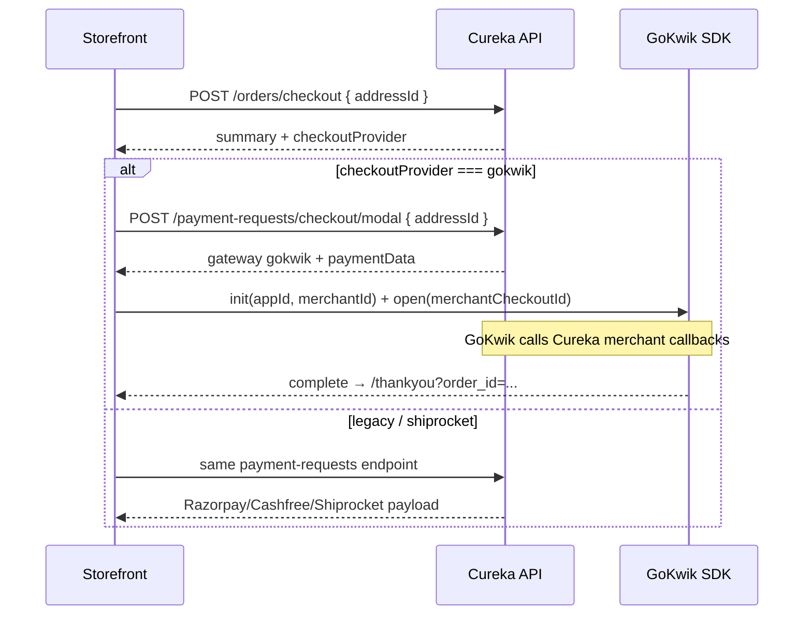

# GoKwik Checkout — Frontend Integration Guide

How the storefront should open the **GoKwik checkout modal** (instead of Razorpay).

**Base URL:** `/api/v1`  
**Auth:** session cookie (`Credentials: include`) + verified user

Related backend notes: [gokwik-integration-audit-and-frontend-handoff.md](./payment-docs/gokwik-integration-audit-and-frontend-handoff.md)

---

## Critical rule

| Endpoint | Purpose |
|----------|---------|
| `POST /orders/checkout` | **Validate only** — pricing summary + which checkout UX to use |
| `POST /payment-requests/checkout` or `/checkout/modal` | **Start checkout** — returns GoKwik / Shiprocket / Razorpay / Cashfree payload |
| `POST /orders` (place order) | **COD / wallet only** — never use for Razorpay or GoKwik |

Do **not** try to open GoKwik by sending `paymentMethod: "RAZORPAY"` (or any `GOKWIK_*` value) to `/orders/checkout`. That field only adjusts fee lines in the summary.

GoKwik is selected by the **admin setting** `gokwikCheckoutEnabled` (`value: "1"`, status active), not by a payment-method string from the browser.

---

## Recommended flow



### Step 1 — Validate cart + learn provider

```http
POST /api/v1/orders/checkout
Content-Type: application/json

{
  "addressId": "f9ab56d7-9848-4770-9274-555722043a19"
}
```

Optional `paymentMethod` (`COD` | `WALLET` | `RAZORPAY` | …) only affects fee lines. Omit it when GoKwik is expected.

**Response includes (among pricing fields):**

```json
{
  "checkoutProvider": "gokwik",
  "grandTotal": 1299,
  "items": []
}
```

| `checkoutProvider` | Storefront action |
|--------------------|-------------------|
| `gokwik` | Open GoKwik SDK (steps 2–3) |
| `shiprocket` | Use Shiprocket `checkoutUrl` from payment-requests |
| `legacy` | Existing Razorpay / Cashfree modal or link flow |

### Step 2 — Start checkout session

Prefer the modal endpoint for in-page UX:

```http
POST /api/v1/payment-requests/checkout/modal
Content-Type: application/json

{
  "addressId": "f9ab56d7-9848-4770-9274-555722043a19"
}
```

(`POST /payment-requests/checkout` uses the same provider routing; use it if you need a payment-link style flow for legacy PG.)

**When GoKwik is enabled, response:**

```json
{
  "gateway": "gokwik",
  "checkoutProvider": "gokwik",
  "paymentData": {
    "merchantCheckoutId": "<active-cart-uuid>",
    "appId": "<public-gokwik-app-id>",
    "merchantId": "<public-merchant-id>",
    "amount": 1299,
    "currency": "INR"
  }
}
```

- `merchantCheckoutId` is the Cureka **cart id**. Pass it unchanged to the SDK. Do not invent a browser-only id.
- Never hard-code `appId` / `merchantId` from secrets; use this response (or env public values that match backend).

### Step 3 — Open GoKwik modal

Pseudocode (exact SDK API follows GoKwik’s env-specific docs):

```ts
if (response.checkoutProvider === 'gokwik') {
  const { appId, merchantId, merchantCheckoutId } = response.paymentData;

  // 1. Load GoKwik checkout SDK for the current env (sandbox vs prod)
  // 2. Initialize with public appId + merchantId
  // 3. Open checkout with merchantCheckoutId
  // 4. Disable the CTA until open succeeds or fails

  // DO NOT open Razorpay Checkout.js
  // DO NOT call POST /orders with paymentMethod RAZORPAY / GOKWIK_*
}
```

### Step 4 — Handle SDK lifecycle

| Event | UI behaviour |
|-------|----------------|
| `open` | Show SDK; keep cart page in background |
| `close` | Re-enable CTA; **do not** clear cart |
| `failure` | Retryable error; keep cart |
| `complete` | Navigate only to allowlisted Cureka URLs, e.g. `/thankyou?order_id=<merchant order id>` |

Backend GoKwik **merchant callbacks** (`/api/v1/gokwik/*`) are the source of truth for order/payment state. Treat SDK data as navigation/display only.

---

## What **not** to send

```json
// ❌ Does NOT open GoKwik
POST /orders/checkout
{ "addressId": "...", "paymentMethod": "RAZORPAY" }

// ❌ Invalid for place-order when GoKwik is the UX
POST /orders
{ "addressId": "...", "paymentMethod": "GOKWIK_PREPAID" }

// ❌ After receiving checkoutProvider: "gokwik"
//    do not create a Razorpay order or call /checkout/modal/verify
```

`GOKWIK_PREPAID` / `GOKWIK_PARTIAL_COD` are written by **GoKwik callbacks** when the order is placed — the storefront does not choose them to open the modal.

---

## Native (legacy) path reminder

When `checkoutProvider === "legacy"`:

1. `POST /payment-requests/checkout/modal` → Razorpay or Cashfree payload (from `razor_pay` / `cash_free` admin settings).
2. Open that PG’s modal.
3. On success: `POST /payment-requests/checkout/modal/verify`.
4. On dismiss: `POST /payment-requests/checkout/modal/cancel`.

Admin keys (not Swagger payment-method names):

| Setting key | Meaning |
|-------------|---------|
| `gokwikCheckoutEnabled` | Prefer GoKwik checkout UX |
| `shiprocketCheckoutEnabled` | Prefer Shiprocket (if GoKwik off) |
| `razor_pay` | Enable Razorpay as native PG |
| `cash_free` | Enable Cashfree as native PG |

Priority: **gokwik → shiprocket → legacy**.

---

## KwikPass login (optional)

If using KwikPass, exchange the opaque token — do not decode it in the browser:

```http
POST /api/v1/auth/kwikpass/exchange
Content-Type: application/json

{ "kpToken": "<opaque-jwe>" }
```

Then refresh `GET /auth/me` and cart.

Logout: Cureka `POST /auth/logout` **and** KwikPass SDK logout.

---

## QA checklist

- [ ] Admin: `gokwikCheckoutEnabled` = `1` / active on the target env
- [ ] `POST /orders/checkout` returns `"checkoutProvider": "gokwik"`
- [ ] `POST /payment-requests/checkout/modal` returns `gateway` + `checkoutProvider` = `gokwik` and non-empty `appId` / `merchantId` / `merchantCheckoutId`
- [ ] CTA opens GoKwik modal (not Razorpay)
- [ ] Close modal keeps cart and re-enables CTA
- [ ] Successful place redirects to thank-you with order id
- [ ] With flag off, same endpoints fall back to Razorpay/Cashfree/Shiprocket without FE `paymentMethod` tricks

---

## Env / secrets (frontend)

Safe to use from API response or public env: `appId`, `merchantId`, SDK script URLs.

Never put in the browser: `GOKWIK_APP_SECRET`, `GOKWIK_CALLBACK_SECRET`, `GOKWIK_WEBHOOK_SECRET`, `KWIKPASS_JWE_SECRET`.
