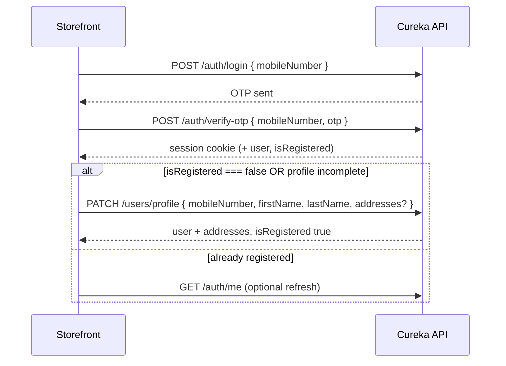

# Storefront User Profile Register / Update

How the UI should complete (or update) a customer profile **after OTP login**, including optional addresses.

**Base URL:** `/api/v1`  
**Auth:** session from `POST /auth/verify-otp`  
**Endpoint:** `PATCH /users/profile`

Related:

- OTP login: `POST /auth/login` → `POST /auth/verify-otp`
- Profile read: `GET /auth/me`
- Address CRUD (separate): `/users/addresses`

---

## When to use this API

Use this after the user verifies OTP and you need to:

1. Save name / email / profile fields
2. Mark the account as registered (`isRegistered: true`)
3. Optionally save one or more delivery addresses in the same call

Do **not** use this to start login. Login/OTP must succeed first.

---

## Auth (required)

After `POST /auth/verify-otp`, the backend sets an HttpOnly `user_session` cookie.

Send requests with credentials so the cookie is included:

```http
PATCH /api/v1/users/profile
Content-Type: application/json
Credentials: include
```

Also accepted (when available):

```http
Authorization: Bearer <session-token>
```

Notes:

- Guard is **session only** — works for users who are not yet registered.
- `verify-otp` may return `token: null` when `isRegistered` is `false`; the **cookie is still set**. Prefer `Credentials: include`.
- Guest users cannot call this unless converted via OTP / KwikPass flow first.

---

## Recommended flow



---

## Request

```http
PATCH /api/v1/users/profile
Content-Type: application/json
```

### Body fields

| Field | Type | Required | Notes |
|-------|------|----------|--------|
| `mobileNumber` | string | **Yes** | 10-digit Indian mobile (`6–9` start). Digits only after normalize. |
| `firstName` | string | **Yes** | Max 100 |
| `lastName` | string | **Yes** | Max 100 |
| `email` | string | No | Valid email, max 255 |
| `gender` | string | No | `male` \| `female` \| `other` \| `prefer_not_to_say` |
| `maritalStatus` | string | No | `married` \| `single` \| `divorced` \| `widowed` |
| `dateOfBirth` | string | No | ISO date, e.g. `1990-06-15` |
| `profileImageUrl` | string | No | Storage path/URL already uploaded |
| `addresses` | array | **No** | Optional. Omit / `null` / `[]` = do not change addresses |

### Address object (when `addresses` is sent)

| Field | Type | Required | Notes |
|-------|------|----------|--------|
| `recipientName` | string | Yes | Min 2, max 150 |
| `phoneNumber` | string | Yes | 10-digit Indian mobile |
| `pincode` | string | Yes | 6-digit Indian pincode |
| `addressLine1` | string | Yes | Max 255 |
| `addressLine2` | string | No | Max 255 |
| `landmark` | string | No | Max 255 |
| `city` | string | Yes | Max 100 |
| `state` | string | Yes | Max 100 |
| `addressType` | string | Yes | `HOME` \| `OFFICE` \| `OTHER` |
| `isDefault` | boolean | No | Default address flag |
| `refId` | string | No | Omit to **create**; include to **update** existing address |

---

## Examples

### 1) Register profile only (no addresses)

```json
{
  "mobileNumber": "9866440427",
  "firstName": "Rahul",
  "lastName": "Sharma",
  "email": "rahul@example.com"
}
```

### 2) Register profile + multiple addresses

```json
{
  "mobileNumber": "9866440427",
  "firstName": "Rahul",
  "lastName": "Sharma",
  "email": "rahul@example.com",
  "gender": "male",
  "maritalStatus": "single",
  "dateOfBirth": "1990-06-15",
  "addresses": [
    {
      "recipientName": "Rahul Sharma",
      "phoneNumber": "9866440427",
      "pincode": "560001",
      "addressLine1": "42, MG Road",
      "addressLine2": "Near Metro",
      "landmark": "Opposite City Mall",
      "city": "Bengaluru",
      "state": "Karnataka",
      "addressType": "HOME",
      "isDefault": true
    },
    {
      "recipientName": "Rahul Sharma",
      "phoneNumber": "9866440427",
      "pincode": "400001",
      "addressLine1": "10, Marine Drive",
      "city": "Mumbai",
      "state": "Maharashtra",
      "addressType": "OFFICE",
      "isDefault": false
    }
  ]
}
```

### 3) Update an existing address later

Include `refId` from a previous response / `GET /users/addresses`:

```json
{
  "mobileNumber": "9866440427",
  "firstName": "Rahul",
  "lastName": "Sharma",
  "addresses": [
    {
      "refId": "RAH20261234",
      "recipientName": "Rahul Sharma",
      "phoneNumber": "9866440427",
      "pincode": "560001",
      "addressLine1": "42, MG Road, Updated",
      "city": "Bengaluru",
      "state": "Karnataka",
      "addressType": "HOME",
      "isDefault": true
    }
  ]
}
```

> When `addresses` is sent with items, omitted existing addresses may be soft-deleted (sync behaviour). Prefer omitting `addresses` entirely if you only want to update profile fields.

---

## Success response

Wrapped in the standard API envelope:

```json
{
  "success": true,
  "statusCode": 200,
  "message": "User registered successfully",
  "data": {
    "id": "12753bd0-7d80-4ca9-8c07-aa037e06bd38",
    "refId": "USE2026XXXX",
    "firstName": "Rahul",
    "lastName": "Sharma",
    "email": "rahul@example.com",
    "mobileNumber": "9866440427",
    "isGuest": false,
    "isRegistered": true,
    "status": "active",
    "role": "customer",
    "gender": "male",
    "maritalStatus": "single",
    "dateOfBirth": "1990-06-15",
    "addresses": [
      {
        "id": "...",
        "refId": "RAH20261234",
        "userId": "...",
        "recipientName": "Rahul Sharma",
        "phoneNumber": "9866440427",
        "pincode": "560001",
        "addressLine1": "42, MG Road",
        "addressLine2": "Near Metro",
        "landmark": "Opposite City Mall",
        "city": "Bengaluru",
        "state": "Karnataka",
        "addressType": "HOME",
        "isDefault": true,
        "createdAt": "...",
        "updatedAt": "..."
      }
    ]
  }
}
```

After success:

- Treat user as registered (`isRegistered: true`)
- Refresh UI from `data` or call `GET /auth/me`

---

## Backend behaviour (UI should rely on this)

1. Resolves the logged-in user from the session token/cookie.
2. Checks `mobileNumber`:
   - Already owned by **another** account → `409 Conflict`
   - Missing / not registered on this user → attaches mobile and registers
3. Saves profile fields and sets `isGuest: false`, `isRegistered: true`.
4. Addresses:
   - omitted / `null` / `[]` → **no address changes**
   - non-empty array → upsert (create without `refId`, update with `refId`)

---

## Error cases

| Status | Meaning | UI action |
|--------|---------|----------|
| `401` | Missing/invalid session | Re-run OTP login |
| `400` | Validation failed (mobile, pincode, enums, etc.) | Show field errors |
| `409` | Mobile or email already used by another account | Ask user to login with that number / change email |
| `404` | Session user not found | Re-login |

Example:

```json
{
  "success": false,
  "statusCode": 409,
  "message": "Mobile number is already associated with another account"
}
```

---

## FE checklist

- [ ] Call only after successful `verify-otp`
- [ ] Always send `Credentials: include`
- [ ] Always send `mobileNumber`, `firstName`, `lastName`
- [ ] Treat `addresses` as optional
- [ ] Use `addressType` values exactly: `HOME` / `OFFICE` / `OTHER`
- [ ] On success, update local user state from `isRegistered: true`
- [ ] Do not open checkout with a guest/unregistered gate if your flow requires a registered profile

---

## Difference vs other endpoints

| Endpoint | Purpose |
|----------|---------|
| `POST /auth/complete-registration` | Name (+ optional email) only |
| `PATCH /users/profile` | **Preferred** — register/update profile + optional addresses |
| `PATCH /users/me` | Profile update for already-registered users (`VerifiedUserGuard`) |
| `POST /users/addresses` | Create a single address separately |
