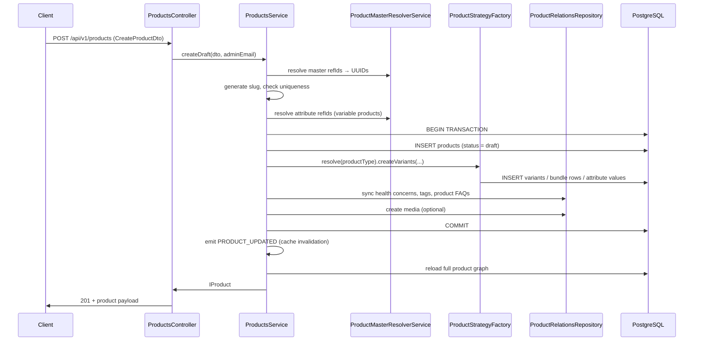

# Product Creation — API Flow

This document describes the end-to-end API flow for creating a product draft in the Cureka backend.

**Related:** [Product Module Architecture](./product-module-architecture.md)

---

## Endpoint

| Method | Path | Auth | Roles |
|--------|------|------|-------|
| `POST` | `/api/v1/products` | Bearer JWT (Admin) | `SUPER_ADMIN`, `ADMIN` |

**Swagger:** `/api/v1/docs` → **Products** → `POST /products`

**Success:** `201 Created`  
**Response message:** `Product draft created successfully`

---

## High-Level Flow



---

## Step-by-Step (Internal)

### 1. Request validation

NestJS validates `CreateProductDto` before the service runs:

- Required: `name`, `productType`, `productNatureRefId`, `categoryRefId`
- `productType` must be one of: `simple`, `variable`, `bundle`
- For **simple / variable**: `variants` array required (min 1 item) when not a bundle
- For **bundle**: `bundleItems` array required (min 1 item)
- All master references use **refId** format (e.g. `HEA20260016`), not UUIDs

### 2. Master resolution

`ProductMasterResolverService.resolve()` converts refIds to internal UUIDs:

| Request field | Master table |
|---------------|--------------|
| `productNatureRefId` | `product_natures` |
| `categoryRefId` | `categories` |
| `subCategoryRefId` | `categories` |
| `subSubCategoryRefId` | `categories` |
| `subSubSubCategoryRefId` | `categories` |
| `brandRefId` | `brands` |
| `manufacturerRefId` | `manufacturers` |
| `packerRefId` | `packers` |
| `importerRefId` | `importers` |
| `healthConcernRefIds[]` | `health_concerns` |
| `faqRefIds[]` | `product_faqs` |

Missing refIds return `404 Not Found`.

### 3. Slug generation

- If `slug` is omitted, it is generated from `name` (lowercase, hyphenated)
- If the slug already exists → `409 Conflict`

### 4. Attribute resolution (variable products)

Each variant's `attributes[].attributeRefId` is resolved against the `attributes` master. Missing attributes → `404 Not Found`.

### 5. Database transaction

All writes happen inside a single transaction. On any failure, everything rolls back.

| Step | Table(s) | Notes |
|------|----------|-------|
| Insert product | `products` | Always created with `status = draft` |
| Create variants | `product_variants`, `variant_attribute_values` | Strategy-dependent |
| Sync health concerns | `product_health_concerns` | Replaces all mappings |
| Sync tags | `product_tags`, `product_tag_mappings` | Creates tag if slug doesn't exist |
| Sync FAQs | `product_faq_mappings` | Links existing `product_faqs` rows |
| Create media | `product_media` | Optional; can link to variant via `variantSku` |

### 6. Post-commit

- Emits `PRODUCT_UPDATED` event → Redis product cache invalidated
- Reloads product with all relations (variants, media, tags, FAQs, bundle items, masters)
- Maps entity → `IProduct` response

---

## Product Type Strategies

The `productType` field selects a creation strategy. **Product type cannot be changed after creation.**

### Simple (`simple`)

| Rule | Detail |
|------|--------|
| Variants | Exactly **1** variant |
| Attributes | **Not allowed** on variants |
| Auto-default | If `variants` is omitted, a default variant is created with SKU `{refId}-DEFAULT`, `mrp/sellingPrice/stock = 0` |

### Variable (`variable`)

| Rule | Detail |
|------|--------|
| Variants | At least **1** variant required |
| Attributes | **Required** on every variant |
| Uniqueness | No two variants may share the same attribute combination |
| Combination key | Stored as `{attributeId:value\|...}` (sorted by attributeId) |

### Bundle (`bundle`)

| Rule | Detail |
|------|--------|
| Bundle items | At least **1** child product via `bundleItems[]` |
| Child products | Must exist and cannot be the bundle itself |
| Variants | Optional — if provided, exactly **1** pricing variant allowed |
| Attributes | Not used on bundle pricing variant |

---

## Request Body Reference

### Core fields

```json
{
  "name": "Dolo 650mg Tablets",
  "slug": "dolo-650mg-tablets",
  "description": "Paracetamol 650mg",
  "productType": "simple",
  "productNatureRefId": "MED20261234",
  "categoryRefId": "HEA20260016",
  "subCategoryRefId": "SUB20260001",
  "brandRefId": "DOL20261234",
  "manufacturerRefId": "MIC20261234",
  "vendorId": null
}
```

### Commerce & policy flags (all optional, default `false`)

| Field | Type |
|-------|------|
| `subscriptionEnabled` | boolean |
| `codAvailable` | boolean |
| `emiAvailable` | boolean |
| `replaceAllowed` | boolean |
| `replaceWindowDays` | integer |
| `returnWindowDays` | integer |

### SEO (optional)

| Field | Type |
|-------|------|
| `metaTitle` | string |
| `metaDescription` | string |
| `metaKeywords` | string[] |

### Relations (optional)

| Field | Type | Behavior |
|-------|------|----------|
| `healthConcernRefIds` | string[] | Maps to product |
| `tagNames` | string[] | Creates tag if new, then maps |
| `faqRefIds` | string[] | Maps existing product FAQs |
| `media` | object[] | See media schema below |

### Variant schema

```json
{
  "sku": "SKU-001",
  "vendorSku": "VSKU-001",
  "barcode": "8901234567890",
  "mrp": 1200,
  "sellingPrice": 999,
  "discountPercentage": 16.75,
  "stock": 20,
  "weight": 0.25,
  "length": 10,
  "width": 5,
  "height": 3,
  "expiresIn": 365,
  "attributes": [
    { "attributeRefId": "COL20261234", "value": "white" }
  ],
  "imageUrls": ["/uploads/images/a.png"]
}
```

### Media schema

```json
{
  "type": "image",
  "url": "/uploads/images/product.png",
  "sortOrder": 0,
  "isPrimary": true,
  "variantSku": "SKU-001"
}
```

`type` values: `image`, `video`, `size_chart`

### Bundle item schema

```json
{
  "childProductRefId": "PRO20261234",
  "quantity": 2
}
```

---

## Request Examples

### Simple product

```http
POST /api/v1/products
Authorization: Bearer <admin-jwt>
Content-Type: application/json
```
 
```json
{
  "name": "Dolo 650mg Tablets",
  "productType": "simple",
  "productNatureRefId": "MED20261234",
  "categoryRefId": "HEA20260016",
  "brandRefId": "DOL20261234",
  "variants": [
    {
      "sku": "DOLO-650-15",
      "mrp": 30,
      "sellingPrice": 28,
      "stock": 500
    }
  ],
  "tagNames": ["bestseller"],
  "codAvailable": true
}
```

### Variable product

```json
{
  "name": "Premium Whey Protein",
  "productType": "variable",
  "productNatureRefId": "SUP20261234",
  "categoryRefId": "HEA20260016",
  "brandRefId": "WEL20263616",
  "variants": [
    {
      "sku": "WHEY-CHOC-1KG",
      "mrp": 2999,
      "sellingPrice": 2499,
      "stock": 50,
      "attributes": [
        { "attributeRefId": "COL20261234", "value": "Chocolate" },
        { "attributeRefId": "SIZ20264567", "value": "1kg" }
      ]
    },
    {
      "sku": "WHEY-VAN-1KG",
      "mrp": 2999,
      "sellingPrice": 2499,
      "stock": 30,
      "attributes": [
        { "attributeRefId": "COL20261234", "value": "Vanilla" },
        { "attributeRefId": "SIZ20264567", "value": "1kg" }
      ]
    }
  ],
  "healthConcernRefIds": ["FIT20261234"],
  "media": [
    {
      "type": "image",
      "url": "/uploads/images/whey.jpg",
      "isPrimary": true
    }
  ]
}
```

### Bundle product

```json
{
  "name": "Immunity Combo Pack",
  "productType": "bundle",
  "productNatureRefId": "MED20261234",
  "categoryRefId": "HEA20260016",
  "bundleItems": [
    { "childProductRefId": "PRO20261111", "quantity": 1 },
    { "childProductRefId": "PRO20262222", "quantity": 2 }
  ],
  "variants": [
    {
      "sku": "COMBO-IMM-001",
      "mrp": 1500,
      "sellingPrice": 1299,
      "stock": 100
    }
  ]
}
```

---

## Response Shape

Returns a full `IProduct` object. Key fields:

```json
{
  "refId": "PRO20261234",
  "name": "Dolo 650mg Tablets",
  "slug": "dolo-650mg-tablets",
  "productType": "simple",
  "status": "draft",
  "productNatureRefId": "MED20261234",
  "productNatureName": "Medicine",
  "categoryRefId": "HEA20260016",
  "categoryName": "Health",
  "variants": [ { "sku": "DOLO-650-15", "mrp": 30, "sellingPrice": 28, "stock": 500, "attributes": [] } ],
  "media": [],
  "healthConcernRefIds": [],
  "tags": [{ "refId": "TAG20261234", "name": "bestseller", "slug": "bestseller" }],
  "faqs": [],
  "bundleItems": [],
  "publishedAt": null,
  "createdAt": "2026-06-01T10:00:00.000Z",
  "updatedAt": "2026-06-01T10:00:00.000Z"
}
```

---

## Error Responses

| HTTP | When |
|------|------|
| `400 Bad Request` | Validation failure, wrong variant count, duplicate combinations, simple product with attributes, bundle self-reference |
| `401 Unauthorized` | Missing or invalid JWT |
| `403 Forbidden` | Admin role not allowed |
| `404 Not Found` | Master refId, attribute refId, child product refId, or product FAQ refId not found |
| `409 Conflict` | Product slug already exists |
| `422 Unprocessable Entity` | DTO validation errors (class-validator) |

---

## Prerequisites (Before Creating a Product)

These master records must exist **before** calling product creation:

1. **Product nature** — `GET /api/v1/master/product-natures`
2. **Category tree** — `GET /api/v1/master/categories`
3. **Brand / manufacturer / packer / importer** (optional) — respective master APIs
4. **Attributes** (variable products only) — `GET /api/v1/master/attributes`
5. **Health concerns** (optional) — `GET /api/v1/master/health-concerns`
6. **Product FAQs** (optional) — create first via `POST /api/v1/product-faqs`, then pass `faqRefIds`

Tags are auto-created from `tagNames` — no separate API call needed.

---

## After Creation

A newly created product is always in **`draft`** status. Typical follow-up calls:

| Action | Endpoint |
|--------|----------|
| View product | `GET /api/v1/products/:refId` |
| Update metadata / mappings | `PATCH /api/v1/products/:refId` |
| Add more variants | `POST /api/v1/products/:productRefId/variants` |
| Map product FAQs | `POST /api/v1/products/:productRefId/product-faqs` |
| Publish | `PATCH /api/v1/products/:refId/publish` |

**Publish requirements:**

- Product must have at least one variant (except bundle type handling)
- Sets `status = published` and `publishedAt = now()`

---

## Files Involved

| Layer | File |
|-------|------|
| Controller | `modules/product/controllers/products.controller.ts` |
| Service | `modules/product/services/products.service.ts` |
| Master resolver | `modules/product/services/product-master-resolver.service.ts` |
| Strategies | `modules/product/strategies/product-strategies.ts` |
| DTO | `modules/product/dto/product.dto.ts`, `variant.dto.ts` |
| Response mapper | `modules/product/mappers/product.mapper.ts` |
| Validators | `modules/product/validators/variant.validator.ts` |
