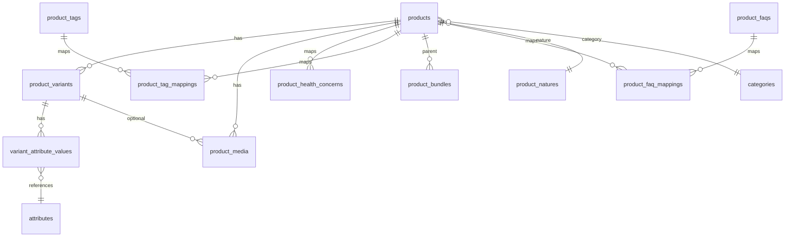
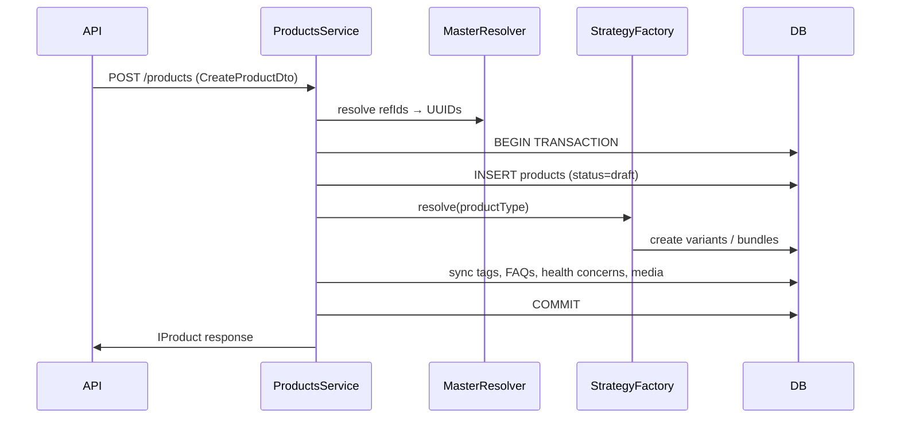

# Product Module Architecture — Cureka Backend

Enterprise-grade product management for a healthcare eCommerce marketplace. Built as a **modular monolith** module at `modules/product/`.

---

## Design Principles

| Principle | Implementation |
|-----------|----------------|
| No monolithic product table | Normalized entities: products, variants, attribute values, media, bundles |
| Variants are first-class | `product_variants` owns SKU, pricing, stock, dimensions |
| Inventory on variants | `stock` column on `product_variants` (warehouse sync ready) |
| Dynamic attributes | `variant_attribute_values` stores `(attributeId, value)` — no fixed color/size columns |
| Strategy pattern | `SimpleProductStrategy`, `VariableProductStrategy`, `BundleProductStrategy` |
| Transactions | Product create / variant bulk insert / bundle mapping run in DB transactions |
| Multi-vendor ready | `vendorId` nullable on `products` |
| Cache | Redis cache-aside on list + detail; invalidated via `PRODUCT_UPDATED` events |

---

## Folder Structure

```
modules/product/
├── product.module.ts
├── controllers/
│   ├── products.controller.ts
│   ├── product-variants.controller.ts
│   └── product-faqs.controller.ts
├── services/
│   ├── products.service.ts              # Orchestrator
│   ├── product-master-resolver.service.ts
│   ├── product-variants.service.ts
│   └── product-faqs.service.ts
├── repositories/
│   ├── products.repository.ts
│   ├── product-variants.repository.ts
│   └── product-relations.repository.ts
├── strategies/
│   ├── interfaces/product-creation.strategy.ts
│   └── product-strategies.ts
├── entities/                            # 10 entities
├── dto/
├── enums/
├── interfaces/
├── mappers/
├── validators/
├── utils/
└── listeners/
    └── product-cache.listener.ts
```

---

## Entity Relationship Diagram



---

## Core Entities

### 1. `products`
Catalog header — name, slug, type, nature, category tree, brand, manufacturer, packer, importer, SEO, policies, status.

- **productType**: `simple` | `variable` | `bundle`
- **status**: `draft` | `published` | `archived` | `inactive`
- **vendorId**: nullable UUID (future multi-vendor)

### 2. `product_variants`
Sellable SKU unit — pricing, stock, dimensions, expiry.

- **sku**: globally unique (partial index, soft-delete aware)
- **vendorSku**: unique when present
- **combinationKey**: normalized attribute fingerprint for duplicate detection

### 3. `variant_attribute_values`
Dynamic attribute storage (no `attribute_options` table):

| variantId | attributeId | value |
|-----------|-------------|-------|
| v1 | color-uuid | white |
| v1 | size-uuid | 1 |

Unique constraint: `(variantId, attributeId)`

### 4. `product_media`
Images/videos/size charts at product or variant level.

### 5. `product_bundles`
Bundle composition: `(parentProductId, childProductId, quantity)`

### 6. `product_tags` + `product_tag_mappings`
Reusable tags with slug; mapped to products.

### 7. `product_faqs` + `product_faq_mappings`
Reusable product FAQ entries mapped to products (separate from future website FAQ master).

---

## Variant Combination Key

UI labels like `white-1` are **display only**. Backend stores normalized relational data and generates:

```
{color-uuid:white|size-uuid:1}
```

Utility: `modules/product/utils/variant-combination-key.util.ts`

- Sorts by `attributeId`
- Normalizes values (trim, lowercase)
- Used for duplicate detection within a product
- Stored on `product_variants.combination_key`
- DB unique index: `(product_id, combination_key)` where not deleted

---

## Product Creation Flow



### Strategy Behavior

| Type | Variant rules |
|------|---------------|
| **SIMPLE** | Exactly 1 variant; no attributes. Auto-default variant if omitted. |
| **VARIABLE** | 1+ variants; each must have attributes; unique combination keys |
| **BUNDLE** | Requires `bundleItems[]`; optional 1 pricing variant |

---

## API Endpoints

Base: `/api/v1/products`  
Auth: Admin JWT Bearer  
Swagger: `/api/v1/docs`

| Method | Path | Description |
|--------|------|-------------|
| POST | `/products` | Create product draft |
| GET | `/products` | Paginated list + filters |
| GET | `/products/:refId` | Product detail |
| PATCH | `/products/:refId` | Update product |
| PATCH | `/products/:refId/publish` | Publish product |
| PATCH | `/products/:refId/status` | Update status |
| DELETE | `/products/:refId` | Soft delete |
| POST | `/products/:productRefId/variants` | Bulk add variants |
| DELETE | `/products/:productRefId/variants/:variantId` | Soft delete variant |
| POST | `/product-faqs` | Create product FAQ |
| POST | `/products/:productRefId/product-faqs` | Map product FAQs to product |

---

## Request Example — Variable Product

```http
POST /api/v1/products
Authorization: Bearer <token>
Content-Type: application/json
```

```json
{
  "name": "Premium Whey Protein",
  "productType": "variable",
  "productNatureRefId": "SUP20261234",
  "categoryRefId": "HEA20260016",
  "brandRefId": "WEL20263616",
  "variants": [
    {
      "sku": "WHEY-WHITE-1KG",
      "vendorSku": "V-WHEY-001",
      "mrp": 2999,
      "sellingPrice": 2499,
      "stock": 50,
      "weight": 1.0,
      "attributes": [
        { "attributeRefId": "COL20261234", "value": "Chocolate" },
        { "attributeRefId": "SIZ20264567", "value": "1kg" }
      ],
      "imageUrls": ["/uploads/images/whey-choco-1kg.jpg"]
    },
    {
      "sku": "WHEY-VAN-1KG",
      "mrp": 2999,
      "sellingPrice": 2499,
      "stock": 30,
      "attributes": [
        { "attributeRefId": "COL20261234", "value": "Vanilla" },
        { "attributeRefId": "SIZ20264567", "value": "1kg" }
      ]
    }
  ],
  "tagNames": ["protein", "fitness"],
  "healthConcernRefIds": ["FIT20261234"]
}
```

---

## Request Example — Simple Product

```json
{
  "name": "Dolo 650mg Strip of 15",
  "productType": "simple",
  "productNatureRefId": "MED20261234",
  "categoryRefId": "HEA20260016",
  "variants": [
    {
      "sku": "DOLO-650-15",
      "mrp": 30,
      "sellingPrice": 28,
      "stock": 500,
      "expiresIn": 730
    }
  ]
}
```

---

## Request Example — Bundle Product

```json
{
  "name": "Immunity Combo Pack",
  "productType": "bundle",
  "productNatureRefId": "SUP20261234",
  "categoryRefId": "HEA20260016",
  "bundleItems": [
    { "childProductRefId": "PRO20261111", "quantity": 1 },
    { "childProductRefId": "PRO20262222", "quantity": 2 }
  ],
  "variants": [
    {
      "sku": "COMBO-IMMUNITY-01",
      "mrp": 1500,
      "sellingPrice": 1299,
      "stock": 100
    }
  ]
}
```

---

## Response Example

```json
{
  "success": true,
  "message": "Product draft created successfully",
  "data": {
    "refId": "PRE20261234",
    "name": "Premium Whey Protein",
    "slug": "premium-whey-protein",
    "productType": "variable",
    "status": "draft",
    "variants": [
      {
        "sku": "WHEY-WHITE-1KG",
        "mrp": 2999,
        "sellingPrice": 2499,
        "stock": 50,
        "combinationKey": "col-uuid:chocolate|siz-uuid:1kg",
        "attributes": [
          { "attributeRefId": "COL20261234", "attributeName": "Color", "value": "Chocolate" }
        ]
      }
    ],
    "tags": [{ "name": "protein", "slug": "protein" }]
  }
}
```

---

## Validation Rules

| Rule | Error |
|------|-------|
| SKU unique globally | 409 Conflict |
| vendorSku unique when set | 409 Conflict |
| slug unique (soft-delete aware) | 409 Conflict |
| sellingPrice ≤ mrp | 400 Bad Request |
| discountPercentage 0–100 | 400 Bad Request |
| Duplicate attributeId in same variant | 400 Bad Request |
| Duplicate variant combination per product | 400 Bad Request |
| Attribute refId must exist in master | 404 Not Found |
| Simple = exactly 1 variant, no attributes | 400 Bad Request |
| Variable = each variant has attributes | 400 Bad Request |
| Bundle = at least 1 bundle item | 400 Bad Request |
| Cannot change productType after create | 400 Bad Request |

---

## Error Response Example

```json
{
  "success": false,
  "statusCode": 409,
  "message": "Duplicate variant attribute combinations detected for this product",
  "timestamp": "2026-06-08T14:00:00.000Z"
}
```

---

## PostgreSQL Indexes

- Partial unique: `products.slug` (active rows)
- Partial unique: `product_variants.sku`, `vendor_sku`
- Partial unique: `(product_id, combination_key)` on variants
- Filter indexes: `product_type`, `status`, `category_id`, `brand_id`, `published_at`

---

## Caching

| Key | TTL |
|-----|-----|
| `products:list:{page}:{limit}:{filterHash}` | `CACHE_TTL` |
| `products:detail:{refId}` | `CACHE_TTL` |

Invalidated on `PRODUCT_UPDATED` event (create/update/delete/publish).

---

## Future Extensions

- **Multi-vendor**: populate `vendorId`, vendor-scoped SKU namespaces
- **Warehouse**: separate `inventory_ledger` per variant
- **Unicommerce**: sync via variant SKU + stock webhooks
- **Elasticsearch**: index products + variant facets from `variant_attribute_values`
- **Queues**: `product.published` domain event for search indexing

---

## Migration

```bash
npm run migration:run
# Migration: 1780508000000-create-product-module-tables.ts
```
