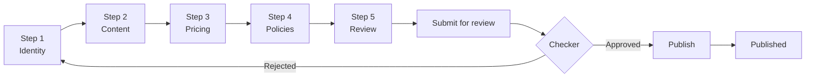

# Product Creation Wizard — Frontend Integration Guide

This document describes the **5-step product creation wizard** API for frontend developers.

**Base URL:** `/api/v1`  
**Auth:** `Authorization: Bearer <admin-jwt>`  
**Swagger:** `/api/v1/docs` → **Product Wizard**

---

## Overview

The UI wizard maps to five backend steps. Each step saves independently — the user can leave and resume later using the product `refId`.

| UI Step | Label | API | When to call |
|---------|-------|-----|--------------|
| 1 | Identity & Classification | `POST/PATCH .../wizard/step-1` | First screen — creates draft |
| 2 | Content & Media | `PATCH .../wizard/step-2` | Descriptions, images, FAQs |
| 3 | Pricing & Inventory | `PATCH .../wizard/step-3` | Variants, SKUs, stock |
| 4 | Policies & Recommendations | `PATCH .../wizard/step-4` | Return/replace rules |
| 5 | Review & Publish | `GET .../wizard`, submit, publish | Summary + go-live |



---

## Wizard State Response

Every save endpoint returns the same wrapper shape:

```json
{
  "refId": "PRO20261234",
  "status": "draft",
  "creationStep": 2,
  "rejectionReason": null,
  "canSubmit": false,
  "canPublish": false,
  "steps": [
    {
      "step": 1,
      "label": "Identity & Classification",
      "completed": true,
      "missingFields": []
    },
    {
      "step": 2,
      "label": "Content & Media",
      "completed": false,
      "missingFields": ["description"]
    },
    {
      "step": 3,
      "label": "Pricing & Inventory",
      "completed": false,
      "missingFields": ["variants"]
    },
    {
      "step": 4,
      "label": "Policies & Recommendations",
      "completed": false,
      "missingFields": []
    },
    {
      "step": 5,
      "label": "Review & Publish",
      "completed": false,
      "missingFields": []
    }
  ],
  "product": { "...full IProduct object..." }
}
```

### Frontend usage

- Store `refId` after step 1 — required for all subsequent calls
- Use `creationStep` to restore the last completed step on page reload
- Use `steps[n].completed` and `missingFields` to show step indicators / validation hints
- Enable **Submit** button when `canSubmit === true`
- Enable **Publish** button when `canPublish === true` (after checker approval)
- Show `rejectionReason` when `status === "rejected"`

### Product statuses

| Status | Meaning | UI action |
|--------|---------|-----------|
| `draft` | In progress or approved after review | Allow editing steps 1–4 |
| `pending_review` | Submitted, awaiting checker | Read-only; show waiting state |
| `rejected` | Checker rejected | Show reason; allow re-edit from any step |
| `published` | Live on storefront | Redirect to product detail / edit via PATCH |

---

## API Endpoints

### Step 1 — Identity & Classification

**Create new draft (first visit)**

```http
POST /api/v1/products/wizard/step-1
Content-Type: application/json
```

**Update existing draft**

```http
PATCH /api/v1/products/:refId/wizard/step-1
```

#### Request body

| Field | Required | UI mapping | Notes |
|-------|----------|------------|-------|
| `name` | Yes | Product name | Max 500 chars |
| `productType` | Yes | Simple / Variable / Bundle | `simple`, `variable`, `bundle` |
| `productNatureRefId` | Yes | Material / nature | From product-natures master |
| `categoryRefId` | Yes | Category level 1 | Up to 4 levels via sub-category refIds |
| `subCategoryRefId` | No | Category level 2 | |
| `subSubCategoryRefId` | No | Category level 3 | |
| `subSubSubCategoryRefId` | No | Category level 4 | |
| `brandRefId` | No | Brand | |
| `healthConcernRefIds` | No | Health concerns | Array of refIds |
| `tagNames` | No | Tags (New launch, Bestseller…) | Auto-created if new |
| `metaTitle` | No | SEO title | |
| `metaDescription` | No | SEO meta description | |
| `metaKeywords` | No | SEO keywords | string[] |
| `slug` | No | URL slug | Auto-generated from name if omitted |

#### Example

```json
{
  "name": "Dolo 650mg Tablets",
  "productType": "simple",
  "productNatureRefId": "MED20261234",
  "categoryRefId": "HEA20260016",
  "subCategoryRefId": "SUB20260001",
  "brandRefId": "DOL20261234",
  "healthConcernRefIds": ["PAIN20261234"],
  "tagNames": ["bestseller", "new-launch"],
  "metaTitle": "Buy Dolo 650mg Online",
  "metaDescription": "Fast relief from fever and pain",
  "metaKeywords": ["dolo", "paracetamol", "fever"]
}
```

#### Planned fields (not yet in API)

- HSN code
- Tax category
- Canonical URL

---

### Step 2 — Content & Media

```http
PATCH /api/v1/products/:refId/wizard/step-2
```

**Prerequisite:** Step 1 must be saved (`creationStep >= 1`).

#### Request body

| Field | Required | UI mapping | Notes |
|-------|----------|------------|-------|
| `description` | Recommended | Long description | Required for step completion |
| `slug` | No | URL slug override | |
| `manufacturerRefId` | No | Manufacturer of origin | |
| `packerRefId` | No | Packer | |
| `importerRefId` | No | Importer | |
| `faqRefIds` | No | Product FAQs | Create FAQs first via `POST /product-faqs` |
| `media` | No | Images / videos / size charts | Replaces all existing media |

#### Media object

```json
{
  "type": "image",
  "url": "/uploads/images/dolo-front.jpg",
  "sortOrder": 0,
  "isPrimary": true,
  "variantSku": "DOLO-650-15"
}
```

`type`: `image` | `video` | `size_chart`

#### Example

```json
{
  "description": "Dolo 650mg is used for fever and mild pain relief.",
  "manufacturerRefId": "MIC20261234",
  "faqRefIds": ["PFQ20261234"],
  "media": [
    {
      "type": "image",
      "url": "/uploads/images/dolo-front.jpg",
      "sortOrder": 0,
      "isPrimary": true
    },
    {
      "type": "size_chart",
      "url": "/uploads/images/dolo-size-chart.jpg",
      "sortOrder": 1
    }
  ]
}
```

#### Planned fields (not yet in API)

- Short description, highlights, key features
- Directions for use, expert advice, safety info, precautions
- Country of origin
- Related blog tags, structured data (JSON-LD)

---

### Step 3 — Pricing & Inventory

```http
PATCH /api/v1/products/:refId/wizard/step-3
```

**Prerequisite:** Step 2 must be saved (`creationStep >= 2`).

#### Request body

| Field | Required | UI mapping | Notes |
|-------|----------|------------|-------|
| `variants` | Yes* | SKUs, MRP, price, stock | *Required for simple/variable |
| `bundleItems` | Yes* | Bundle composition | *Required for bundle type |
| `subscriptionEnabled` | No | Subscription eligible | default `false` |
| `codAvailable` | No | COD available | default `false` |
| `emiAvailable` | No | EMI available | default `false` |

> **Important:** Saving step 3 **replaces all variants** for the product. Always send the full variant list.

#### Variant object

```json
{
  "sku": "DOLO-650-15",
  "vendorSku": "V-DOLO-001",
  "barcode": "8901234567890",
  "mrp": 30,
  "sellingPrice": 28,
  "discountPercentage": 6.67,
  "stock": 500,
  "weight": 0.05,
  "expiresIn": 365,
  "attributes": [
    { "attributeRefId": "SIZ20264567", "value": "15 tablets" }
  ]
}
```

#### Simple product example

```json
{
  "variants": [
    {
      "sku": "DOLO-650-15",
      "mrp": 30,
      "sellingPrice": 28,
      "stock": 500
    }
  ],
  "codAvailable": true
}
```

#### Variable product example

```json
{
  "variants": [
    {
      "sku": "WHEY-CHOC-1KG",
      "mrp": 2999,
      "sellingPrice": 2499,
      "stock": 50,
      "attributes": [
        { "attributeRefId": "COL20261234", "value": "Chocolate" },
        { "attributeRefId": "SIZ20264567", "value": "1kg" }
      ]
    },
    {
      "sku": "WHEY-VAN-1KG",
      "mrp": 2999,
      "sellingPrice": 2499,
      "stock": 30,
      "attributes": [
        { "attributeRefId": "COL20261234", "value": "Vanilla" },
        { "attributeRefId": "SIZ20264567", "value": "1kg" }
      ]
    }
  ],
  "subscriptionEnabled": true
}
```

#### Bundle product example

```json
{
  "bundleItems": [
    { "childProductRefId": "PRO20261111", "quantity": 1 },
    { "childProductRefId": "PRO20262222", "quantity": 2 }
  ],
  "variants": [
    {
      "sku": "COMBO-IMM-001",
      "mrp": 1500,
      "sellingPrice": 1299,
      "stock": 100
    }
  ]
}
```

#### Variant rules by type

| Type | Variants | Attributes |
|------|----------|------------|
| `simple` | Exactly 1 | Not allowed |
| `variable` | 1 or more | Required on each variant; unique combinations |
| `bundle` | 0 or 1 (pricing SKU) | `bundleItems` required |

#### Planned fields (not yet in API)

- Min/max order quantity
- Inventory sync toggle
- Batch pricing (MRP, sale price, stock per batch)
- Show expiry date toggle

---

### Step 4 — Policies & Recommendations

```http
PATCH /api/v1/products/:refId/wizard/step-4
```

**Prerequisite:** Step 3 must be saved (`creationStep >= 3`).

#### Request body

| Field | Required | UI mapping | Notes |
|-------|----------|------------|-------|
| `replaceAllowed` | No | Replacement allowed | default `false` |
| `replaceWindowDays` | No | Replacement window | days |
| `returnWindowDays` | No | Return window | days |

#### Example

```json
{
  "replaceAllowed": true,
  "replaceWindowDays": 7,
  "returnWindowDays": 14
}
```

#### Planned fields (not yet in API)

- Refund eligibility, non-returnable reason
- Cross-sell, upsell, frequently bought together mappings
- Related brand, sponsored placement, campaign scheduling

---

### Step 5 — Review & Publish

#### Get wizard state (review screen)

```http
GET /api/v1/products/:refId/wizard
```

Use this on the review screen to show completion status and the full product snapshot.

#### Submit for checker review

```http
POST /api/v1/products/:refId/wizard/submit
```

- Requires `canSubmit === true` (steps 1–4 complete)
- Sets `status` → `pending_review`
- Product becomes **read-only** until approved or rejected

#### Checker approve (SUPER_ADMIN only)

```http
POST /api/v1/products/:refId/wizard/approve
```

- Sets `status` back to `draft` with step 5 complete
- Creator can now publish

#### Checker reject (SUPER_ADMIN only)

```http
POST /api/v1/products/:refId/wizard/reject
Content-Type: application/json
```

```json
{
  "reason": "Missing compliance images in step 2"
}
```

- Sets `status` → `rejected`
- Creator sees `rejectionReason` and can re-edit steps

#### Publish (go live)

```http
PATCH /api/v1/products/:refId/publish
```

- Call after checker approval (`canPublish === true`)
- Sets `status` → `published`, `publishedAt` → now

---

## Recommended Frontend Flow

### 1. New product

```
1. User fills Step 1 form
2. POST /products/wizard/step-1  →  store refId in route/state (e.g. /products/create/:refId)
3. User fills Step 2 → PATCH .../wizard/step-2
4. User fills Step 3 → PATCH .../wizard/step-3
5. User fills Step 4 → PATCH .../wizard/step-4
6. Step 5 review → GET .../wizard
7. Submit → POST .../wizard/submit
8. (Checker) Approve → POST .../wizard/approve
9. Publish → PATCH .../publish
```

### 2. Resume draft

```
1. User opens draft from product list (status = draft | rejected)
2. GET /products/:refId/wizard  →  read creationStep, navigate to that step
3. Pre-fill forms from response.product
4. Continue PATCH saves from current step
```

### 3. Save & exit

Any step PATCH is a full save — no separate "save draft" endpoint needed. Product is always `draft` until submitted.

---

## Master Data Dependencies

Load these before the wizard (step 1 dropdowns):

| Master | API |
|--------|-----|
| Product natures | `GET /api/v1/master/product-natures` |
| Categories | `GET /api/v1/master/categories` |
| Brands | `GET /api/v1/master/brands` |
| Health concerns | `GET /api/v1/master/health-concerns` |
| Attributes (step 3, variable) | `GET /api/v1/master/attributes` |
| Manufacturers / packers / importers (step 2) | respective master APIs |

Product FAQs must be created before step 2:

```http
POST /api/v1/product-faqs
{ "question": "...", "answer": "..." }
```

---

## Error Handling

| HTTP | When | Frontend action |
|------|------|-----------------|
| `400` | Step order violated, incomplete submit, validation error | Show message; redirect to incomplete step |
| `404` | Invalid refId or master refId | Show not-found toast |
| `409` | Duplicate slug or SKU | Highlight conflicting field |
| `422` | DTO validation | Show field-level errors |

### Step order error example

Attempting step 3 before step 2:

```json
{
  "statusCode": 400,
  "message": "Complete step 2 before saving step 3"
}
```

### Pending review lock

```json
{
  "statusCode": 400,
  "message": "Product is pending review and cannot be edited"
}
```

---

## UI Field → API Mapping (Quick Reference)

| UI screen field | API field | Step |
|-----------------|-----------|------|
| Product name | `name` | 1 |
| Brand | `brandRefId` | 1 |
| Material | `productNatureRefId` | 1 |
| Health concern | `healthConcernRefIds` | 1 |
| Product type | `productType` | 1 |
| Category (L1–L4) | `categoryRefId`, `subCategoryRefId`, … | 1 |
| Tags | `tagNames` | 1 |
| SEO title / description / keywords | `metaTitle`, `metaDescription`, `metaKeywords` | 1 |
| Long description | `description` | 2 |
| Manufacturer / packer / importer | `manufacturerRefId`, `packerRefId`, `importerRefId` | 2 |
| Images / videos / size charts | `media[]` | 2 |
| Product FAQs | `faqRefIds` | 2 |
| MRP / selling price / stock | `variants[].mrp`, `sellingPrice`, `stock` | 3 |
| SKU / barcode | `variants[].sku`, `barcode` | 3 |
| Variant attributes | `variants[].attributes` | 3 |
| Bundle items | `bundleItems[]` | 3 |
| Subscription / COD / EMI | `subscriptionEnabled`, `codAvailable`, `emiAvailable` | 3 |
| Return / replace policy | `returnWindowDays`, `replaceAllowed`, `replaceWindowDays` | 4 |
| Submit for review | `POST .../wizard/submit` | 5 |
| Publish | `PATCH .../publish` | 5 |

---

## Legacy Single-Shot API

The monolithic `POST /api/v1/products` endpoint still exists for backward compatibility but **should not be used by the wizard UI**. Use the step endpoints above instead.

---

## Postman Collection

Import `docs/postman/Cureka-Product-Wizard.postman_collection.json` into Postman.

1. Set collection variable `baseUrl` (default `http://localhost:3000/api/v1`)
2. Run **Admin Login** — auto-saves `adminToken`
3. Run **Step 1 — Create Draft** — auto-saves `productRefId`
4. Continue steps 2–5

---

## Changelog

| Date | Change |
|------|--------|
| 2026-06-01 | Initial 5-step wizard API |
